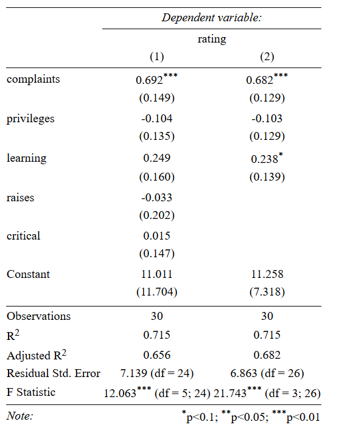

```{r setup, include=FALSE}
knitr::opts_chunk$set(echo = FALSE)
```


## What is R?

R is an open source programming language with a particular focus on statistical programming

- Originally developed as 'S' by Bell Labs in 1993


## R in comparison


(source: IEEE Spectrum)

## R interface (console-only)

- Command line, unlike SPSS/Stata
- An interpreted programming language
- Purist’s interface: Text-editor & copy paste


## R with RStudio

RStudio is an Integrated Developer Environment (IDE) and serves as: 

- Code editor

    + Code highlighting/completion, indentation, …
    + Feed code from editor to R-console
    
- Project manager
- Workspace viewer
- Data browser
- Enhanced output viewer
- Help browser


## Using RStudio

**RStudio windows at startup**

- Source editor
- Console
- Workspace
- Multi-purpose-panel

**Projects**

- A working directory for each project
- Code: .r files
- Dataset/Workspace: .Rdata files


## Using RStudio (II)	

**Basic Workflow**

- Edit in code editor (.r-file)
- Paste to console
- Save Workspace/Datasets (.Rdata-file)
- Save code routinely (no auto-save!)

**Shortcuts**

- Run code from editor: Select line and ctrl+Enter
- Switch between source and console: ctrl+1, ctrl+2
- Clear console: ctrl+L
- 'Arrow up' gives you the last line of code in the console
- Press Alt+Shift+K to see all keyboard shortcuts


## Fundamentals of the R language

- Use # to comment code (will not be run)
- Case-sensitivity: ```data``` vs ```Data```
- Assigning objects: <- and =

```{r, echo = T}
# Assign the number 5 to an object called number
number <- 5
number
```

```{r, echo = T}
# Assign the character string Hello World
string <- "Hello World"
string
```    

## Functions

Functions perform operations on the input given and end in ()

```{r, echo = T}
# e.g. find the class of number
class(number)
```


## Operations on scalars

You can use R as a calculator:
```{r, echo = T, eval=F}
2 + 3
2 - 3
2 * 3
2 / 3
```

Functions on scalars: 
```{r, echo = T}
a <- 5
factorial(a)
```

## Special values in R

- `NA`: not available, missing
- `NULL`: does not exist, is undefined
- `TRUE`, `T`: logical true
- `FALSE`, `F`: logical false


## Finding special values

| Function  | Meaning              |
| --------- | -------------------- |
| `is.na`   | Is the value `NA`    |
| `is.null` | Is the value `NULL`  |
| `isTRUE`  | Is the value `TRUE`  |
| `!isTRUE` | Is the value `FALSE` |


```{r, echo = T}
absent <- NA
is.na(absent)
```


## Operations

| Operator | Meaning                  |
| -------- | ------------------------ |
| `<`      | less than                |
| `>`      | greater than             |
| `==`     | equal to                 |
| `<=`     | less than or equal to    |
| `>=`     | greater than or equal to |
| `!=`     | not equal to             |
| `a | b`  | a or b                   |
| `a & b`  | a and b                  |


## Naming objects

- Object names cannot have spaces

    + Use `CamelCase`, `name_underscore`, or `name.period`

- Avoid creating an object with the same name as a function 
(e.g. `c` and `t`) or special value (`NA`, `NULL`, `TRUE`, `FALSE`).

- Use descriptive object names

- Each object name must be unique in an environment.

    + Assigning something to an object name that is already in use will overwrite the object's previous contents.
    
    
## R is object-oriented

Objects are R's nouns and include (not exhaustive):

- character strings
- numbers
- vectors of numbers or character strings
- matrices
- data frames
- lists

## Vectors

A vector is a container of objects put together in an order.
```{r, echo = T}
# Define a vector
a <- c(1,4,5)
b <- c(3,6,7)
```

```{r, echo = T}
# Join multiple vectors
ab <- c(a,b)
```

```{r, echo = T, eval = F}
# Find vector length (number of its elements)
length(a)
```

```{r, echo = T, eval = F}
# Reference vector components
ab[4] # Index one element in vector
ab[4:6] # Index several elements in a vector
ab[ab==6] # Index with condition
```


## Operations on vectors

| Operation     | Meaning                  |
| --------      | ------------------------ |
| `sort(x)`     | sort a vector            |
| `sum(x)`      | sum of vector elements   |
| `mean(x)`     | arithmetic mean          |
| `median(x)`   | median value             |
| `var(x)`      | variance                 |
| `sd(x)`       | standard deviation       |
| `factorial(x)`| factorial of a number    |


## Task 1

Calculate the mean of the vector 1,99,3,4,5,6,8. What‘s the mean if you out the 'outlier'?


## Task 1 (solution)

Calculate the mean of the vector 1,99,3,4,5,6,8. What‘s the mean if you out the 'outlier'?

```{r, echo = T}
# Defining vector using sequence between 3 and 6
a <- c(1,99,3:6,8) 
mean(a)

# Calculate the mean of a but exclude the highest number
mean(a[a!=max(a)])
```


## Matrices

A Matrix is a square 2 dimensional container, i.e. vectors combined by row or column

- Must specify number or rows and columns `matrix(x,nrow,ncol,byrow)`

    + x: vector of length nrow*ncol
    + nrow: number of rows
    + ncol: number of columns
    + byrow: TRUE or FALSE, specifies direction of input


## Task 2

Assign a 6 x 10 matrix with 1,2,3,…,60 as the data.


## Task 2 (solution)

Assign a 6 x 10 matrix with 1,2,3,…,60 as the data.

```{r, echo = T}
m <- matrix(1:60, nrow=6, ncol=10)
m
```


## Referencing matrices

- Like vectors, you can reference matrices by elements

    + `a[i,j]` refers to the ith row, jth column element of object `a`

- Can also reference rows/columns, these are vectors

    + `a[i,]` is ith row, `a[,j]` is jth column


## Task 3

Extract the 9th column of the matrix from the previous problem. How can you find the 4th element in the 9th column?
    
    
## Task 3 (solution)

Extract the 9th column of the matrix from the previous problem. How can you find the 4th element in the 9th column?

```{r, echo = T}
m[,9]
m[4,9]
m[,9][4]
```


## Data frames

Data frames are a two-dimensional container of vectors with the same length. Each column (vector) can be of a different class and can be indexed with `[,]` or `$`. You can use functions like `nrow()`, `ncol()`, `dim()`, `colnames()`, or `rownames()` on your df.

```{r, echo = T}
# Combine two vectors into a data frame
number <- c(1, 2, 3, 4)
name <- c('John', 'Paul', 'George', 'Ringo')
df <- data.frame(number, name, stringsAsFactors = FALSE)
df
```


## Lists

A list is an object containing other objects that can have different lengths and classes.

```{r, echo = T}
# Create a list with three objects of different lengths
list1 <- list(beatles = c('John', 'Paul', 'George', 'Ringo'),
              alive = c('Paul', 'Ringo'), albums = 1:13)
list1
```


## R's build-in data sets
There are a number of example data sets available within `R`.

```{r, echo = T, eval=FALSE}
# List internal data sets:
data()
```

```{r, echo = T, eval = F}
# Load swiss data set:
data(swiss)
# Find data description:
?swiss
```


## Importing data

You can read  data and assign it to an object. The most frequently used functions to read data include:

- `load()`: To open `.RData` files
- `read.csv()`: Reads csv file
- `read.table()`: Is more general and allows to set separators
- `read.dta()`: From `foreign` library, used to read Stata files


## Exporting data

You can export your data in various formats:

- `save()`: Only readable in R, but can store multiple objects
- `write.csv()`: Writes matrix/dataframe to csv
- `write.table`: Writes matrix to a tab delimited text file
- `write.dta()`: Writing in Stata format, requires `foreign` library


## For() loops

For() loops are used to loop around a vector/matrix to do something.
```{r, echo = T}
m <- matrix(1:5, nrow=1, ncol=5)
m
for (j in 1:3){
     m[,j]=0
}
m
```


## For() loops (II)

You can also 'nest' a `for()` loop in another `for()` loop
```{r, echo = T}
m <- matrix(1:15, nrow=3, ncol=5)
for (i in 1:2){
  for (j in 1:4){
    m[i,j]=0
  }
}
m
```


## Task 4

Create a matrix with `matrix(1:20,nrow=4,ncol=5)` and another with `matrix(NA,nrow=4,ncol=5)`. Adapt the second to the first matrix using `for()`

- hint: define a 'counter‘ variable that increments by 1 each time you move to the next cell


## Task 4 (solution)

Create a matrix with `matrix(1:20,nrow=4,ncol=5)` and another with `matrix(NA,nrow=4,ncol=5)`. Adapt the second to the first matrix using `for()`


```{r, echo = T}
counter=1
m1 <- matrix(1:20,nrow=4,ncol=5)
m2 <- matrix(NA,nrow=4,ncol=5)
for (j in 1:5){
  for (i in 1:4){
    m2[i,j]=counter
    counter=counter+1
  }
}
```

## Task 4 (alternative solution)

Create a matrix with `matrix(1:20,nrow=4,ncol=5)` and another with `matrix(NA,nrow=4,ncol=5)`. Adapt the second to the first matrix using `for()`


```{r, echo = T}
m1 <- matrix(1:20,nrow=4,ncol=5)
m2 <- matrix(NA,nrow=4,ncol=5)
for (j in 1:5){
  for (i in 1:4){
    m2[i,j]=m1[i,j]
  }
}
```


## If() statements 

If() statements are used to make conditions on executing some code. If condition is true, action is done. 
```{r, echo = T}
a <- 3
b <- 4
number <- 0
if(a<b){
  number=number+1
}
number
```

Tests for conditions: `==; >; <; >=; <=; !=`


## Task 5

Create the two objects `a <- sample(c(4,0),20,replace=TRUE)` and 
`m <- matrix(a,nrow=4,ncol=5)`. Now recode all the 4s into 1s using if() and for() statements.


## Task 5 (solution)

Create the objects `a <- sample(c(4,0),20,replace=TRUE)` and 
`b <- matrix(a,nrow=4,ncol=5)`. Now recode all the 4s into 1s in `b` using if() and for() statements.

```{r, echo = T}
a <- sample(c(4,0),20,replace=TRUE)
b <- matrix(a,nrow=4,ncol=5)

for (j in 1:5){
  for (i in 1:4){
    if (b[i,j]==4){
      b[i,j]=1       
    }
  }
}
```


## Creating Functions

If you want to repeat an operation it is often useful to create your own Function. Functions have names, inputs and outputs and simplify your code.

```{r, echo = T}
# Find the sample mean of a vector
fun_mean <- function(x){
    sum(x) / length(x)
}

## Find the mean
data(swiss)
fun_mean(x = swiss$Infant.Mortality)
```


## Task 6

Write a function that takes a number and doubles it.


## Task 6 (solution)

Write a function that takes a number and doubles it.

```{r, echo = T}
double <- function(x){
output <- x * 2
output
}
double(8)
```


## Apply function

`Apply` allows you to apply a function to every row or every column. This can be done with a `for()` loop, but `apply()` is usually much faster and simpler. `Apply()` takes the following form: `apply(X, MARGIN, FUN, ...)`.

```{r, echo = T}
m <- matrix(c(1:10, 11:20), nrow = 10, ncol = 2)
# mean of the rows
apply(m, 1, mean)
# mean of the columns
apply(m, 2, mean)
```


## Task 7

Load up the build-in R dataset 'iris' and use `apply()` to get the mean of the first 4 variables.


## Task 7 (solution)

Load up the build-in R dataset 'iris' and use `apply()` to get the mean of the first 4 variables.

```{r, echo = T}
attach(iris)
apply(iris[,1:4], 2, mean)
```


## Packages

You can greatly expand the number of functions by installing and loading 
user-created packages.

```{r, echo=T, eval=FALSE}
# Install dplyr package
install.packages('dplyr')

# Load dplyr package
library(dplyr)
```

You can also call a function directly from a specific package with the double
colon operator (`::`).

```{r, echo = T, eval=FALSE}
Grouped <- dplyr::group_by(combined_df, character_vector)
```


## Tidy data

Most of the time data sets have to be cleaned before you can run statistical analyses on them. To help streamline this process Hadley Wickham laid out principles of data tidying which links the physical structure of a data set to its meaning (semantics).

- In tidy data:

    + Each variable is placed in its own column
    + Each observation is placed in its own row
    + Each type of observational unit forms a table
    

## Tidy data

**Not tidy**:

| Person       |  treatmentA | treatmentB |
| ------------ | ----------- | ---------- |
| John Smith   |             | 2          |
| Jane Doe     | 16          | 11         |

**Tidy**:

| Person       |  treatment  | result     |
| ------------ | ----------- | ---------- |
| John Smith   | a           |            |
| Jane Doe     | a           | 16         |
| John Smith   | b           | 2          |
| Jane Doe     | b           | 11         |


## Messy to tidy data

```{r, echo = T}
# Create messy data
messy <- data.frame(
  person = c("John Smith", "Jane Doe"), 
  a = c(NA, 16), b = c(2, 11))
# Gather the data into tidy format
library(tidyr)
tidy <- gather(messy, treatment, result, a:b)
tidy
```


## Merging data

Once you have tidy data frames, you can merge them for analysis. Each observation must have a unique identifier to merge them on.

```{r, echo = T}
data(swiss)
swiss$ID <- rownames(swiss) # Create ID
df <- merge(swiss[,c(1:3,7)], swiss[,4:7], by = "ID")
```


## Appending data

You can also add observations to a data frame.

```{r, echo = T}
data(swiss)
df <- swiss[1:3,1:3]
df2 <- rbind(df, swiss[4,1:3])
df2
```


## Using dplyr

The `dplyr` package has powerful capabilities to manipulate data frames quickly.

```{r, echo=T, warning=F}
library(dplyr)
data(swiss)
swiss$ID <- rownames(swiss) # Create ID
df <- dplyr::filter(swiss, Fertility > 90) %>% 
  dplyr::select(ID, Fertility, Catholic)
df
```

## Piping

Piping allows to pass a value forward to a function call and produces faster compilation and enhanced code readability. In `R` use `%>%` from the `dplyr` package.


```{r, echo = T}
# Not piped:
values <- rnorm(1000, mean = 10)
value_mean <- mean(values)
round(value_mean, digits = 2)
```

```{r, echo = T, message=F}
# Piped:
library(dplyr)
rnorm(1000, mean = 10) %>% mean() %>% round(digits = 2)
```


## Tabulation

There are a number of ways to generate tables in R. Two useful tools that are good to know are: 

- `kable`: for creating tables from data frames
- `stargazer`: for creating tables of regression model output

In R, models are fit using the adequate functions e.g. `lm()` for OLS. Many models are packaged in one function, e.g. logistic regression is used with the `glm()` (generalized linear model) function by specifying the model type.


## kable
```{r, echo = T}
library(knitr)
kable(head(mtcars[,1:6]), digits = 2)
```


## stargazer

`kable` is limited if we want to create regression output tables, especially for multiple models. `stargazer` is good for this. `stargazer` can output tables in various formats. 

To export a table to word document use: `type = 'html'`.


## stargazer example
```{r, echo=T, message=F, eval=F}
library(stargazer)
# Run regressions
output <- lm(rating ~ complaints + privileges + learning 
                        + raises + critical, data=attitude)
output2 <- lm(rating ~ complaints + privileges + learning,
              data=attitude)

# Create table
stargazer(output, output2, type="html", 
          out="attitude.htm")
```


## stargazer example



## Plotting with R

R has a powerful graphics engine to produce high quality graphs e.g.:

- `plot`: Basic plotting function (e.g. for scatterplots)
- `hist()`: Histograms
- `dotchart()`: Dot plots
- `boxplot()`: Box-and-whisker plots

## Histograms
```{r, echo=T, fig.width= 4, fig.height = 3.5}
# Create a histogram
data(swiss)
hist(swiss$Fertility, freq=FALSE, main="Fertility Rates")
```

## Dotchart

```{r, echo=T, fig.width= 6, fig.height = 3.5}
# Create a dot plot
data(swiss)
dotchart(swiss[1:5,2], labels=rownames(swiss))
```

## ggplot2
R has several systems for making graphs, but `ggplot2` is one of the most elegant and most versatile. `ggplot2` implements the grammar of graphics, a coherent system for describing and building graphs.

- Each plot is made of layers. Layers include the coordinate system (x-y), points, labels, etc.
- Each layer has aesthetics (`aes`) including x & y, size, shape, and color.
- The main layer types are called geometrics(`geom`) and include
lines, points, etc.

## ggplot2 example
```{r, echo = T, fig.width= 5, fig.height = 2.4}
library(ggplot2)
ggplot(data = mpg) + 
  geom_point(mapping = aes(x = displ, y = hwy))
```


## ggplot2 customization: color
```{r, echo = T, fig.width= 5, fig.height = 2.4}
library(ggplot2)
ggplot(data = mpg) + 
 geom_point(mapping = aes(x = displ, y = hwy, color = class))
```


## ggplot2 customization: theme
```{r, echo = T, fig.width= 5, fig.height = 2.4}
library(ggplot2)
ggplot(data = mpg) +  theme_bw() +
 geom_point(mapping = aes(x = displ, y = hwy, color = class))
```
