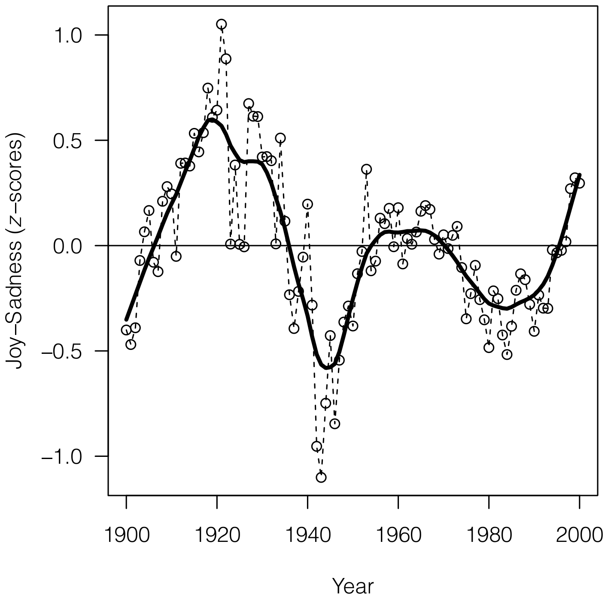
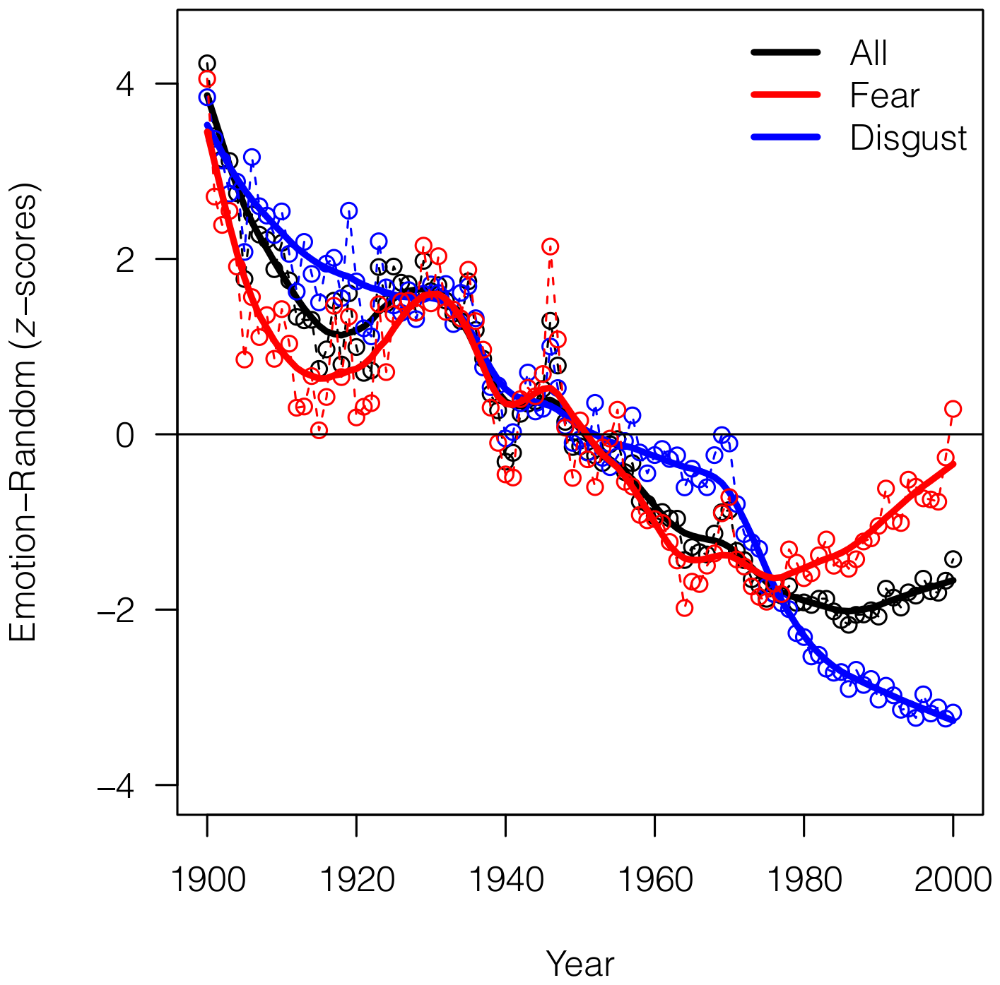
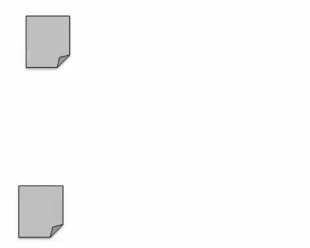
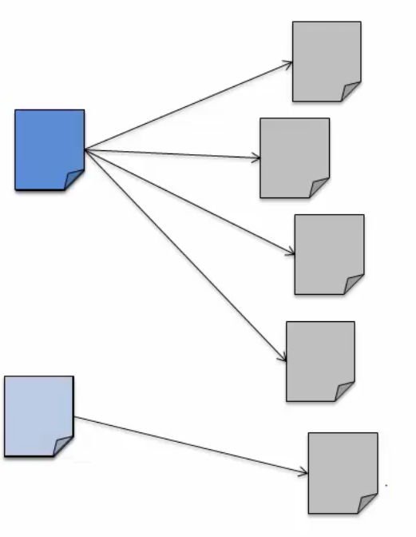
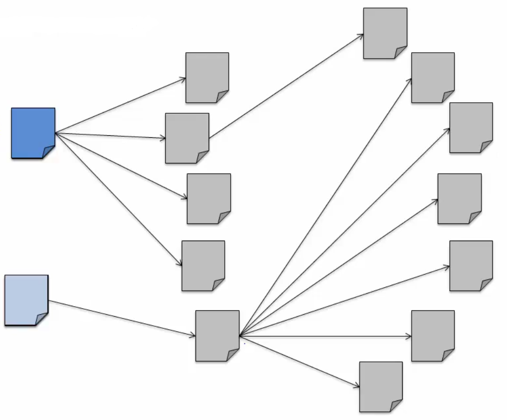
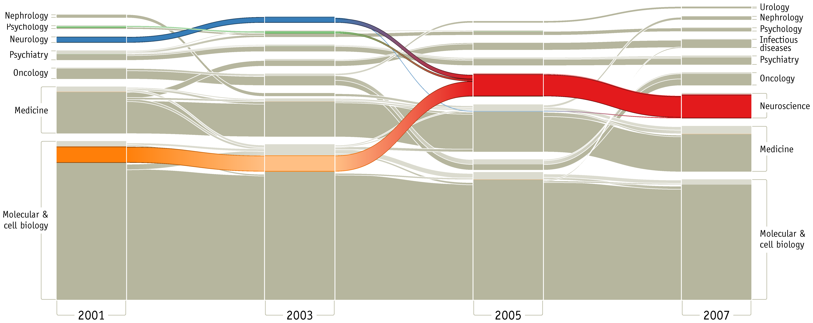
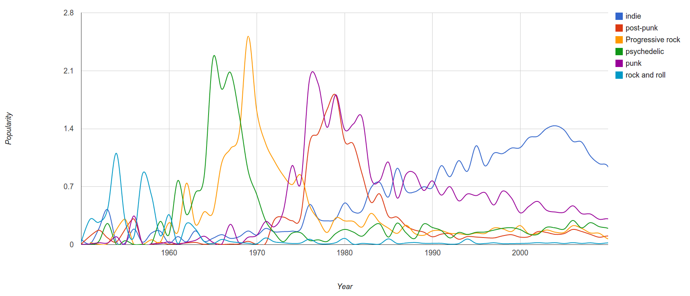
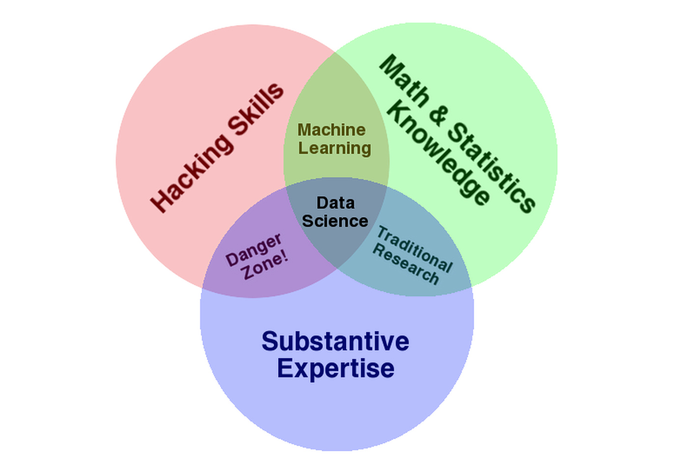
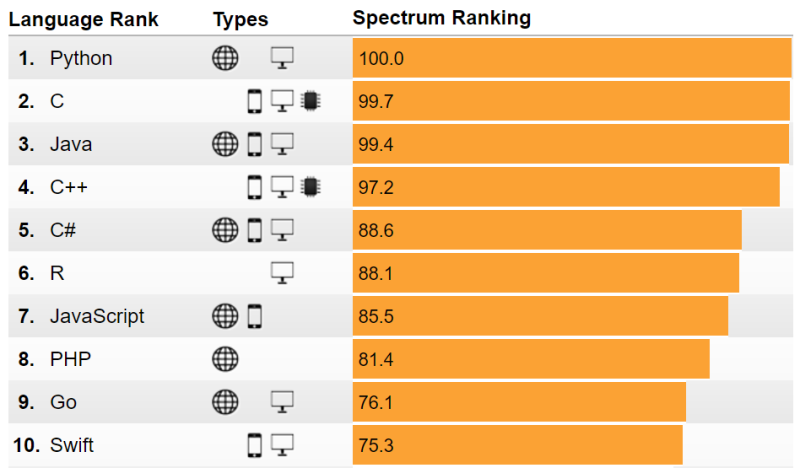

```{r setup, include=FALSE}
knitr::opts_chunk$set(echo = FALSE)
```
## Plan for Today

1. **Introductions**

2. **Data Science Examples**

3. **What is Data Science?**

4. **Why Study Data Science?**

5. **Logistics**


# Introductions

## About myself

- Postdoc at Hertie since May 2015 (Governance Report)
- PhD in PolSci (Uni Mannheim)
- Research on parties, legislative politics, electoral behavior
- Working with R since 2011 (switched from STATA)

**Contact**:

- <a href="mailto:haber@hertie-school.org"><i class="fa fa-envelope"></i> haber@hertie-school.org</a>


## About yourself
- Who are you?
- Why did you take this class?
- What are your expectations?
- How much experience do you have with R?

# Data Science Examples

## Data Science Example 1: Politics
```{r, out.width = "250px", echo = F, fig.align='center'}
knitr::include_graphics("img/electoralCollege.pdf")
```  

- Nate Silver ([fivethirtyeight.com](http://fivethirtyeight.com/)) predicted the election perfectly
- How?
\newline

\footnotetext{Example adapted from Bill Howe, University of Washington}

## Data Science Example 1: Politics

> "The bar set by the competition was invitingly low. Someone could look like a genius simply by doing some fairly basic research into what really has
predictive power in a political campaign."
Nate Silver, Nov. 10, 1012

- Predictive power in this case was the aggregated state polls 

\alert{Simple methods plus enough good data wins!}

## Related: Obama's data driven campaign

> "In the 21st century, the candidate with the best data, merged with the best messages dictated by that data, wins."
Andrew Rasiej, Personal Democracy Forum

> "...the biggest win came from good old SQL on a Vertica data warehouse and from providing access to data to dozens of analytics staffers who could follow their own curiosity and distill and analyze data as the needed."
Dan Woods, Jan 13 2013, CITO Research

## Data Science Example 2: Digital Humanities

Acerbi et al. 2013. **[The Expression of Emotions in 20th Century Books.](http://journals.plos.org/plosone/article?id=10.1371/journal.pone.0059030)** PLoS ONE 8(3).

_Have the words that we choose to use in our collective literature changed over time and  does that tell us something about culture?_

1. Convert all the digitized books in the 20th century into n-grams (http://books.google.com/ngrams/)

2. Label each 1-gram with a mood score (https://wordnet.princeton.edu/)

3. Count the occurences of each mood word
$$M_\gamma = \frac{1}{n}\sum_{i=1}^{n}\frac{C_i}{C_{the}}; M_{Z \gamma}=\frac{M_\gamma - \mu_M}{\sigma_M}$$
- why normalize by the total occurences of the word _the_?

    + _the_ is a better indicator of prose than the total number of words

## The Expression of Emotions: Result 1
```{r, out.width = "220px", echo = F, fig.align='center'}

``` 

## The Expression of Emotions: Result 2
```{r, out.width = "220px", echo = F, fig.align='center'}

``` 

## The Expression of Emotions: References

2. Michel J-P, Shen YK, Aiden AP, Veres A, Gray MK, et al. (2011) **Quantitative analysis of culture using millions of digitized books.** Science 331: 176–182. 
3. Lieberman E, Michel J-P, Jackson J, Tang T, Nowak MA (2007) **Quantifying the evolutionary dynamics of language.** Nature 449: 713–716. 
4. Pagel M, Atkinson QD, Meade A (2007) **Frequency of word-use predicts rates of lexical evolution throughout Indo-European history.** Nature 449: 717–720. 

\alert{All science is becoming data science!}


## Data Science Example 3: Bibliometrics

- How important is a particular scientific paper, relative to other papers?

```{r, out.width = "200px", echo = F, fig.align='center'}

``` 

## Data Science Example 3: Bibliometrics

- How important is a particular scientific paper, relative to other papers? \alert{Count the number of citations!}
    
```{r, out.width = "130px", echo = F, fig.align='center'}

``` 

## Data Science Example 3: Bibliometrics

- How do we decided now?

```{r, out.width = "200px", echo = F, fig.align='center'}

``` 

## Data Science Example 3: Bibliometrics

- How do we decided now? \alert{A paper is important if a lot of other important papers point to it!}

```{r, out.width = "200px", echo = F, fig.align='center'}

``` 

## Data Science Example 3: Bibliometrics

\alert{Google's pagerank algorithm}

- Add up all the weights of your neighbors and give them to yourself and then pass on that weight to everybody that you link to. And you keep going with this until you've reached some convergence condition and you end up with the relative
importance of these pages

## Data Science Example 3: Mapping Change

Rosvall, Martin and Carl T. Bergstrom. 2010.
**[Mapping Change in Large Networks.](http://journals.plos.org/plosone/article?id=10.1371/journal.pone.0008694)** PLoS. 

- mapping change in science by studying citation patterns

```{r, out.width = "300px", echo = F}

``` 

\alert{Use data science to uncover the emergence of new fields of science}

## Data Science Example 4: Music

```{r, out.width = "300px", echo = F}

```

> Since we have a large amount of user tag data available we can easily correlate tags and years and measure "popularity" of a genere by counting the number of artists formed in a specific year."
Janni Kovacs, Last.FM

## Data Science Example 5: Flu Trends

```{r, out.width = "200px", echo = F, fig.align='center'}
knitr::include_graphics("img/fluTrends.png")
```

## Data Science Example 6: Earthquake

- October 22, 2012: Six Italian seismologists sentenced to six years in prison for manslaughter for failing to predict magnitude 6.3 earthquake in April 2009 (later cleared)

```{r, out.width = "200px", echo = F, fig.align='center'}

```

# What is Data Science?

## Data Science Quotes

> "Hot New Gig in Tech" Fortune

> "The next sexy job" Hal Varian, Google's Chief Economist, NYT, 2009

> "Data science, as it's practiced, is a blend of Red-Bull-fueled hacking and espresso-inspired statistics" Mike Driscoll, CEO of metamarkets

## Data Science Venn Diagram (by Drew Conway)

```{r, out.width = "300px", echo = F, fig.align='center'}

```

## What do data scientist do?


> "They need to find the nuggest of truth in data and then explain it to the business leaders" Richard Snee, EMC

> "I worry that the Data Scientist role is like the mythical 'webmaster' of the 90s: master of all trades." Aaron Kimball, CTO Zymergen


## Three types of tasks

1. Preparing to run a model \alert{(Data Munging)}

    + Gathering, cleaning, integrating, restructuring, transforming, loading, filtering, deleting, combining, merging, verifying, extracting, shaping
    
2. Running the model \alert{(Statistics)}

3. Communicating the results \alert{(Visualization)}


# Why Study Data Science?

## Research

**The 80-20 rule**

- Most data are messy

    + You spent most of your time cleaning/preparing data
    + You learn lot about the structure of your data
    
## Job opportunitites

- Data analysis skills are highly valued in businesses
```{r, out.width = "200px", echo = F, fig.align='center'}
knitr::include_graphics("img/RSalaries.png")
```
O'Reilly Data Science Survey 2016

## Why R?

- Open source: makes it highly customizable and easily extensible
- Over 7,500 packages and counting
- Used by many social scientists interested in data analysis
- Powerful tool to generate elegant and effective plots
- Command-line interface and scripts favors reproducibility.
- Excellent documentation and online help resources.

## Why R?

- Becoming one of most popular languages in Data Science.

```{r, out.width = "200px", echo = F, fig.align='center'}

```

IEEE Spectrum 2017

# Logistics

## Overview

- We meet every Monday (except for days when there is no class)
- Bring your own computer - R!
- Material is/will be on [GitHub](https://github.com/mhaber/HertieDataScience/) and [Moodle](https://moodle.hertie-school.org/course/view.php?id=1657)

**Office Hours**:

- Room: 3.60 (until 15 September)
- By appointment

## Part I: Data Exploration

- Data Visualization (11.09.)
- Data Transformation (18.09.)
- Exploratory Data Analysis (25.09.)

## Part II: Data Wrangling

- Data Import (02.10.)
- Tidy Data (09.10.)
- Relational Data (16.10.)
- Working with Strings (30.10.)
- Web Scraping (06.11.)

## Part III: Data Communication

- Markup languages (13.11.)
- Graphics for communication (20.11)

- **Guest Lecture – Work of a Data Scientist (27.11.)**


## Requirements

| Name                            | Percentage | Due             |
|---------------------------------|------------|-----------------|
| Homework Exercises              | 50%        | Weekly          |
| Data Project                    | 40%        | Final Exam Week |
| Attendance/active Participation | 10%        | -               |

## Weekly homework exercises

- 10 small excercises
- Can be completed in teams of two
- Account for 5% each
- Answers submitted mainly trough [Moodle](https://moodle.hertie-school.org/course/view.php?id=1657)
- Due Sundays at 23:59


## Final research project

- Apply your data science skills to large dataset
- Can be completed in teams of two
- Due in the final exam week

## Attendance/Participation

- Regular attendance
- Active participation (\alert{Ask questions!!!})
- Found errors or have ideas for improvement? Submit issues to GitHub:

<https://github.com/mhaber/HertieDataScience/issues>


# Homework for next week

## Install software

- R:

    + R (version 3.4.1): <http://cran.rstudio.com/>
    + RStudio (dev build): <http://www.rstudio.org/download/daily/desktop/>

- R packages

    + devtools (for installing development versions)
    + tidyverse (R packages designed for data science)

## GitHub

**Setup Git/GitHub** 

- Set up (free) GitHub account: <https://github.com/join>.

- Integrate GitHub into RStudio: <https://www.r-bloggers.com/rstudio-and-github/>

- Clone the course's repository to your project folder

##  {.standout}
That's it for today. Questions?
