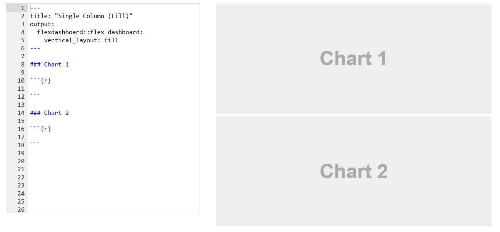
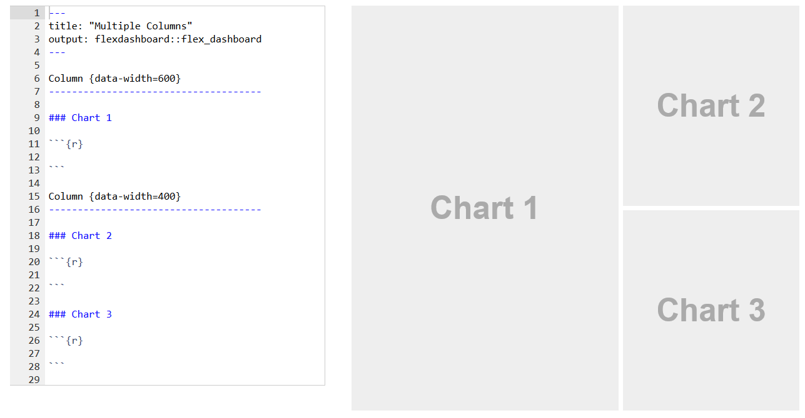
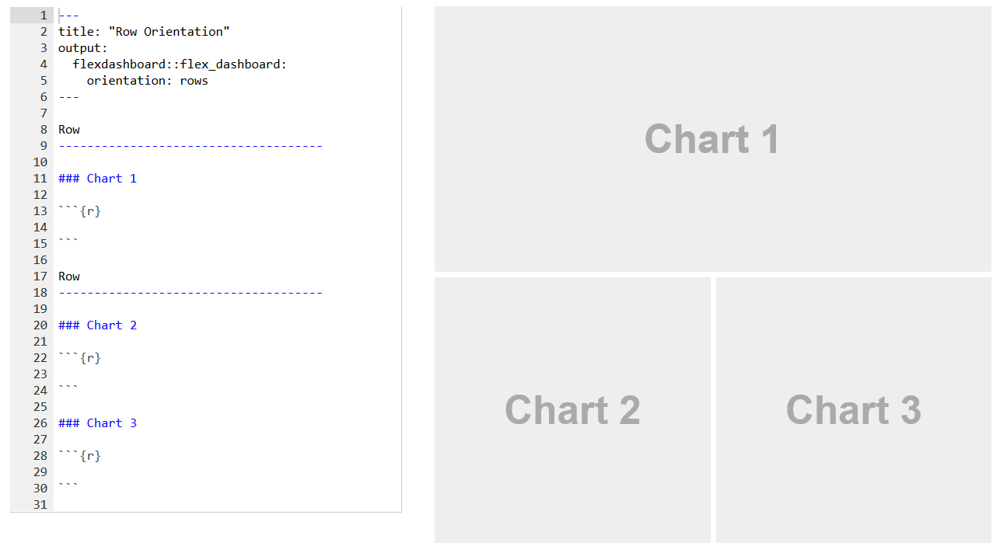
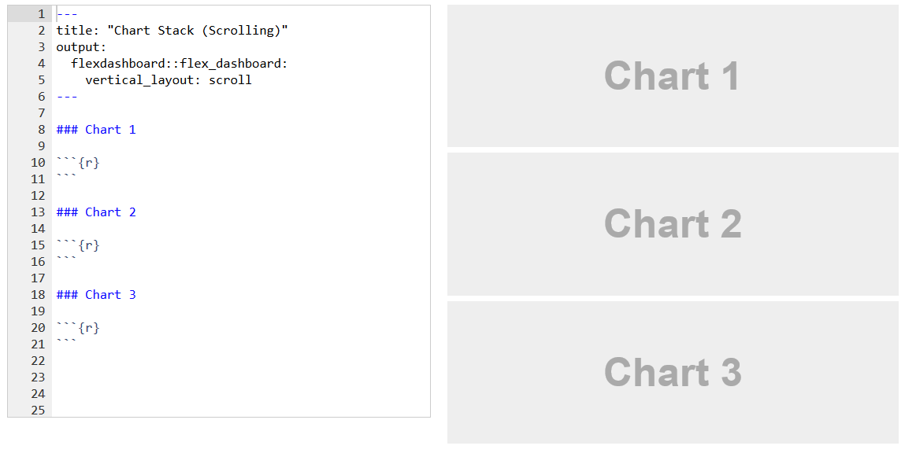
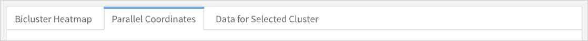
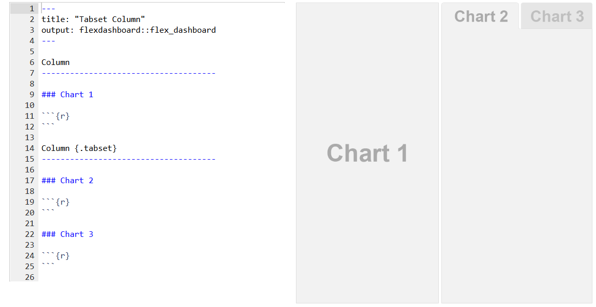
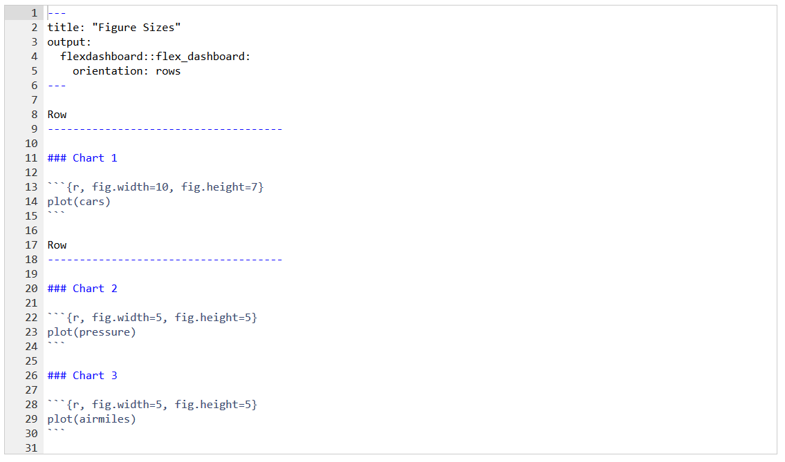
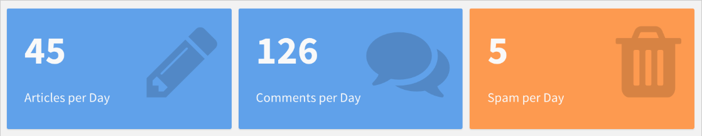
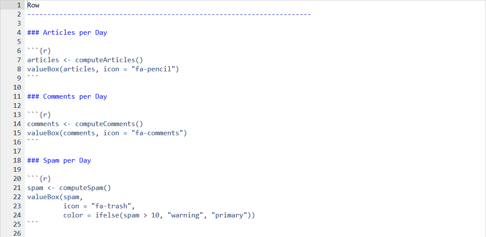
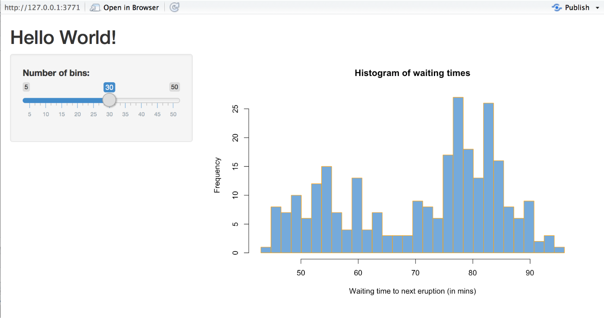

# Prerequisites

## Packages

```{r, message=FALSE, warning=FALSE}
library(htmlwidgets) #install.packages("htmlwidgets")
library(dygraphs) #install.packages("dygraphs") 
library(flexdashboard) # install.packages("flexdashboard")
library(DT) #install.packages("DT")
library(shiny) #install.packages("shiny")
library(plotly) #install.packages("plotly")
library(ggplot2) 
```

# Interactive dashboards

## Why use dashboards?

- R, it provides three core plotting systems:

    + base plots
    + lattice plots
    + ggplot2 plots

- writing codes for plotting graphs in R time & again can get tiring
- difficult to create an interactive visualization for story narration using above packages

## Goal of a dashboard

* Translate complicated data into a more readable, more understandable format for less technical people

* Dashboards allow non-data scientists to see the numbers that are important to them upfront and make connections based on their expertise

* Share your analysis (in an interactive manner) with the community

## `htmlwidgets`

A framework for creating HTML widgets that render in various contexts including the R console, 'R Markdown' documents, and 'Shiny' web applications.

`htmlwidgets` seamlessly bridges R and JavaScript. HTML widgets work just like R plots except they produce interactive web visualizations. 

There are over 30 packages on CRAN which provide htmlwidgets: 
[Available widgets](http://www.htmlwidgets.org/showcase_metricsgraphics.html)

## `htmlwidgets` example

```{r, eval = FALSE}
dygraph(nhtemp, main = "New Haven Temperatures") %>% 
  dyRangeSelector(dateWindow = c("1920-01-01", "1960-01-01"))
```

## Time-series data visualization

```{r, echo = FALSE}
dygraph(nhtemp, main = "New Haven Temperatures") %>% 
  dyRangeSelector(dateWindow = c("1920-01-01", "1960-01-01"))
```

# `flexdashboard`

## `flexdashboard`

Purpose: To create interactive dashboards using rmarkdown.

* Use R Markdown to publish a group of related data visualizations as a dashboard.

* Ideal for publishing interactive JavaScript visualizations based on `htmlwidgets` (also works with standard base, lattice, and grid graphics).

* Flexible and easy to specify row and column-based layouts. Charts are intelligently re-sized to fill the browser and adapted for display on mobile devices.

* Storyboard layouts for presenting sequences of visualizations and related commentary.

## `flexdashboard` example

[Nuclear Waste Sites](https://beta.rstudioconnect.com/jjallaire/htmlwidgets-waste-sites/htmlwidgets-waste-sites.html)


## Creating a `flexdashboard`

You can create a flexdashboard in R Markdown document with the `flexdashboard::flex_dashboard` output format.

```{r, echo = FALSE}
knitr::include_graphics("img/NewRMarkdown.png")
```

## Basic layout

Dashboards are divided into columns and rows. Output components are delineated using level 3 markdown headers (`###`).

By default, dashboards are laid out within a single column, with charts stacked vertically within a column and sized to fill available browser height. 

Example layout: Single column with two charts:

```{r, echo = FALSE}

```

## Multiple columns

To lay out charts using multiple columns you introduce a level 2 markdown header (`--------------`) for each column. For example, this dashboard displays 3 charts split across two columns. Chart 1 is moved into its own columny, which has also been given a larger size via the data-width attribute:

```{r, echo = FALSE}

```

## Layout by row

You can orient dashboards row-wise  by specifying the `orientation: rows option`:

```{r, echo = FALSE}

```

## Scrolling layout

Flexdashboard charts are laid out to automatically fill the height of the browser. If you have many charts you’ll probably want to scroll rather than fit them all onto the page. You can control this behavior using the `vertical_layout` option and specify `scroll` to layout charts at their natural height, scrolling the page if necessary.

```{r, echo = FALSE}

```

## Tabsets

You can also lay components out as a tabset.

```{r, echo = FALSE}

```

To layout a row or column as a tabset you simply add the `{.tabset}` attribute to the section heading:

```{r, echo = FALSE}

```

## Including Components

You include htmlwidgets in an R Markdown document just like you include R plots:

```{r, echo = FALSE}
knitr::include_graphics("img/components.png")
```

Note: `htmlwidgets embed data directly in their host web page which could lead to performance problems for larger datasets. For larger dataset sizes the use of standard R graphics may be preferable.

## R Graphics

You can use any chart created with standard R graphics (base, lattice, ggplot2, etc.) with flexdashboard.

When creating static (non-Shiny) dashboards containing standard R graphics it’s critical to define knitr `fig.width` and `fig.height` values as close as possible to what they’ll actually be on the page

```{r, echo = FALSE}

```

## Static tables

A simple table is ideal for smaller numbers of records (i.e. 40-50 or less). For static dashboards, you can use the `knitr::kable` function to output your dataset:

```{r}
knitr::kable(mtcars)
```

## Dynamic data tables

The [DT](http://rstudio.github.io/DT/) package (an interface to the DataTables JavaScript library) can display R matrices or data frames as interactive HTML tables that support filtering, pagination, and sorting.

```{r}
DT::datatable(mtcars, options = list(bPaginate = FALSE))
```

## Value Boxes

You can use the `valueBox` function to display single values along with a title and optional icon:

```{r, echo = FALSE}


```

## More layout options

See the [flexdashboard](http://rmarkdown.rstudio.com/flexdashboard/using.html#layout) web site for more layout option.

# `Plotly`

## `Plotly`

* Allows to easily translate ggplot2 graphics to an interactive web-based version.

* The R package also provides high-level bindings for working directly with the `plotly.js` graphing library.

* [Plotly Cheatsheet](https://images.plot.ly/plotly-documentation/images/r_cheat_sheet.pdf)

## `ggplotly`

```{r, warning=FALSE, message=FALSE}
p <- ggplot(data = diamonds, aes(x = cut, fill = clarity)) +
            geom_bar(position = "dodge")
ggplotly(p)
```

## Choropleth map with `plot_ly`

```{r, eval = FALSE}
plot_ly(
type = 'choropleth',
locations = c('AZ','CA','VT'),
locationmode = 'USA-states',
colorscale = 'Viridis' ,
z = c(10 ,20 ,40 )) %>% 
layout(geo = list(scope = 'usa'))
```

## Choropleth Maps

```{r, echo = FALSE}
plot_ly(
type = 'choropleth',
locations = c('AZ','CA','VT'),
locationmode = 'USA-states',
colorscale = 'Viridis' ,
z = c(10 ,20 ,40 )) %>% 
layout(geo = list(scope = 'usa'))
```


# Shiny

## `Shiny`

`Shiny` is an R package that makes it easy to build interactive web apps straight from R. You can host standalone apps on a webpage or embed them in R Markdown documents or build dashboards.

Shiny Example: [Movie Explorer](https://shiny.rstudio.com/gallery/movie-explorer.html)

## Structure of a Shiny App

Shiny apps are contained in a single script called `app.R`. The script `app.R` lives in a directory (for example, `newdir/`) and the app can be run with `runApp("newdir")`.

- `app.R` has three components:

    + a user interface object
    + a server function
    + a call to the shinyApp function

The user interface `(ui)` object controls the layout and appearance of your app. The `server` function contains the instructions that your computer needs to build your app. Finally the `shinyApp` function creates Shiny app objects from an explicit UI/server pair.

Shiny is a single-file app, which means you can copy and paste the entire app into the R console.

## Hello Shiny UI Layout

```{r, eval = FALSE}
# Define UI for app that draws a histogram ----
ui <- fluidPage(
  titlePanel("Hello Shiny!"), # App title
  sidebarLayout(  # Sidebar layout with input and output definitions
    sidebarPanel( # Sidebar panel for inputs
      sliderInput(inputId = "bins", # Input: Slider for the number of bins
                  label = "Number of bins:",
                  min = 1,
                  max = 50,
                  value = 30)),
    mainPanel( # Main panel for displaying outputs
      plotOutput(outputId = "distPlot") # Output: Histogram
    )
  )
)
```

## Hello Shiny server

```{r, eval = FALSE}
# Define server logic required to draw a histogram ----
server <- function(input, output) {
  # Histogram of the Old Faithful Geyser Data ----
  output$distPlot <- renderPlot({
    
    x    <- faithful$waiting
    bins <- seq(min(x), max(x), length.out = input$bins + 1)
    
    hist(x, breaks = bins, col = "#75AADB", border = "white",
         xlab = "Waiting time to next eruption (in mins)",
         main = "Histogram of waiting times")
    })
}
```

## Complete structure of a Shiny app

```{r, eval = FALSE}
ui <- ...

server <- ...

shinyApp(ui = ui, server = server)
```

## Running an app

Every Shiny app has the same structure: an `app.R` file that contains `ui` and `server`. You can create a Shiny app by making a new directory and saving an `app.R` file inside it. It is recommended that each app will live in its own unique directory.

You can run a Shiny app by giving the name of its directory to the function runApp. For example if your Shiny app is in a directory called `my_app`, run it with the following code:

```{r, eval = FALSE}
runApp("my_app") # assumes the app directory is wd
```

## Exercise

Create a new directory named `App-1` in your working directory. Then copy and paste the `app.R` script from Hello Shiny. 

Launch your app by running `runApp("App-1")`. Then click escape and make some changes to your app:

- Change the title from "Hello Shiny!" to "Hello World!".

- Set the minimum value of the slider bar to 5.

- Change the histogram border color from "white" to "orange".

## Exercise

When you are ready, launch your app again. Your new app should match the image below.

```{r, echo = FALSE}

```

## More Shiny examples

You can create Shiny apps by copying and modifying existing Shiny apps. The Shiny [gallery](https://shiny.rstudio.com/gallery/) provides some good examples, or use the eleven pre-built Shiny examples listed below.

```{r, eval = FALSE}
runExample("01_hello")      # a histogram
runExample("02_text")       # tables and data frames
runExample("03_reactivity") # a reactive expression
runExample("04_mpg")        # global variables
runExample("05_sliders")    # slider bars
runExample("06_tabsets")    # tabbed panels
runExample("07_widgets")    # help text and submit buttons
runExample("08_html")       # Shiny app built from HTML
runExample("09_upload")     # file upload wizard
runExample("10_download")   # file download wizard
runExample("11_timer")      # an automated timer
```

## Shiny with flexdashboard

You can easily add Shiny to a flexdashboard and enable viewers to change underlying parameters and see the results immediately. This is done by adding `runtime: shiny` to a standard flexdashboard and then adding one or more input controls that dynamically drive the appearance of the components within the dashboard.

Using Shiny with flexdashboard turns a static R Markdown visualization into an interactive tool. Note: interactive dashboards need to be [deployed](http://rmarkdown.rstudio.com/authoring_shiny.html#deployment) to a Shiny Server to be shared broadly.

You can also use the [shinydashboard](https://rstudio.github.io/shinydashboard/) package to create a shiny dashboard.

## Creating a shiny flexdashboard

The steps required to add Shiny components to a flexdashboard are as follows:

1. Add `runtime: shiny` to the options declared at the top of the document (YAML front matter).

2. Add the `{.sidebar}` attribute to the first column of the dashboard to make it a host for Shiny input controls.

3. Add Shiny inputs and outputs as appropriate.

4. When including plots, be sure to wrap them in a call to `renderPlot` to ensure that graphs dynamically respond to changes and are automatically re-sized. 

## Shiny flexdashboard example

```{r, echo = FALSE}
knitr::include_graphics("img/shinyDash.png")
```

## Another Shiny flexdashboard examples

[CRAN Downloads](https://jjallaire.shinyapps.io/shiny-crandash/)

# Homework Exercises

## Homework Exercises

Create a dashboard for the `flights` data in the `nycflights13` package. For example, your dashboard could show a linegraph of the total flights per month or the average delay per month. You could also embed a shiny app that let's you select an airline carrier or a specific destination.

You can use this [dashboard](https://edgarruiz.shinyapps.io/flights-dashboard/) for inspiration. The code to create the dashboard app is located [here](https://gist.github.com/edgararuiz/89e771b5d1b82adaa0033c0928d1846d)

Deadline: Sunday, November 26 before midnight.

# Next week

## Q & A with Jennifer Ahrens from DSSG

Next week, Jennifer Ahrens will come to class from 12-2 and answer your questions about what it takes to kickstart a career in data science. Jennifer is working as a data scientist at [Data Science for Social Good](http://dssg-berlin.org/), a company that provides data science solutions to non-profits pro bono.
