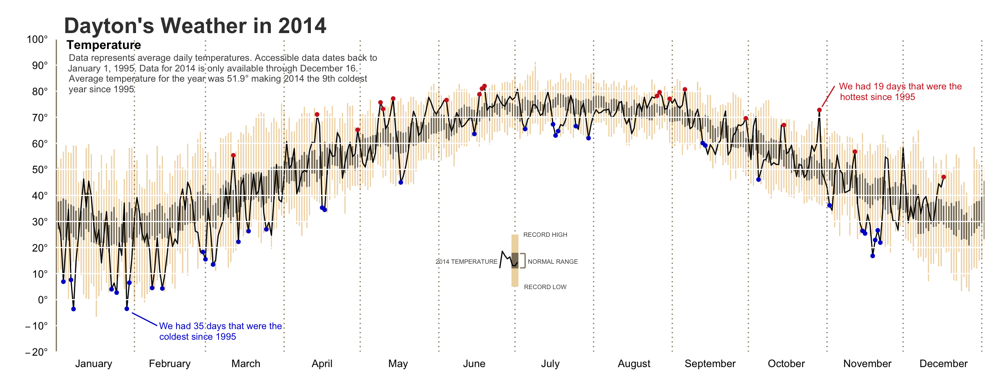
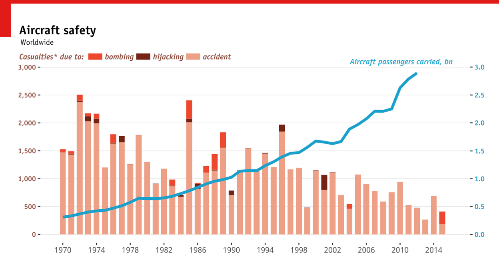
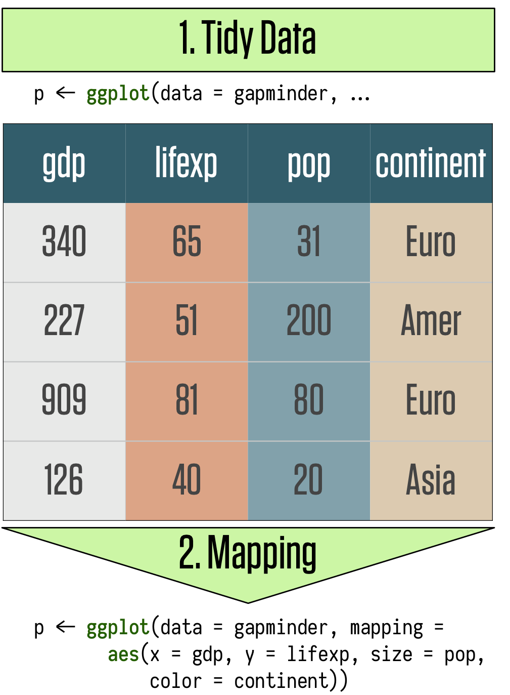
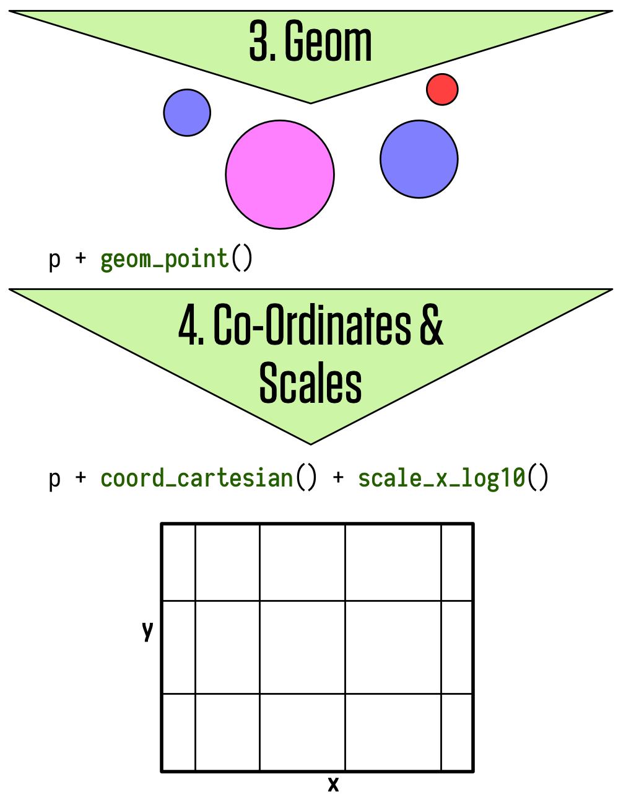
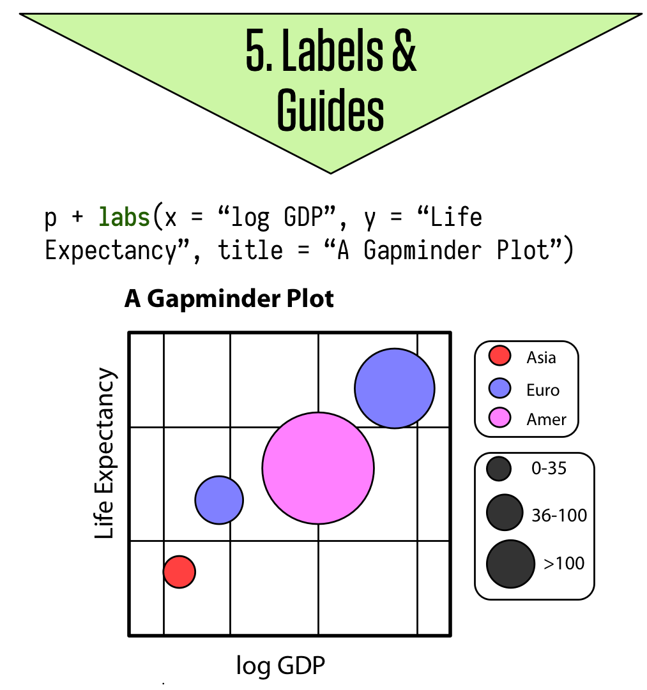

## Plan for Today

1. **Making sure everyone is set up**

2. **Data visualization in base R**

3. **Data visualization with ggplot2**

4. **Excercises**

# Making sure everyone is set up

## Packages

Load the tidyverse 
```{r, message=FALSE}
library(tidyverse)
```

If you get the error message "there is no package called ‘tidyverse’", you'll need to first install it, then run `library()` again.

```{r eval = FALSE}
install.packages("tidyverse")
library(tidyverse)
```

## Data

Install and load the package `gapminder`
```{r, message=FALSE}
library(gapminder)
```

# Data visualization in base R

## Why do we use graphs in data analysis?

- To understand data properties
- To find patterns in data
- To suggest modeling strategies
- To "debug" analyses
- To communicate results

## Plotting with R

R has a powerful graphics engine to produce high quality graphs e.g.:

- `plot`: Basic plotting function (e.g. for scatter plots)
- `hist()`: Histograms
- `dotchart()`: Dot plots
- `boxplot()`: Box-and-whisker plots

## Histograms
```{r, echo=T, fig.width= 4, fig.height = 2.5}
# Create a histogram
data(swiss)
hist(swiss$Fertility, freq=FALSE, main="Fertility Rates")
```

## Dotchart

```{r, echo=T, fig.width= 6, fig.height = 3.5}
# Create a dot plot
data(swiss)
dotchart(swiss[1:5,2], labels=rownames(swiss))
```

# Data visualization with ggplot2

## Why use ggplot2
Base R functions like `plot` and `hist` are great for quickly displaying data but are not very aesthetic, and are limited in the quantity and type of information conveyed.

R has several systems for making graphs, but `ggplot2` is one of the most elegant and most versatile. `ggplot2` implements the grammar of graphics, a coherent system for describing and building graphs.

## ggplot2 examples

```{r, out.width = "300px", echo = F, fig.align='center'}

```  

[Source](http://rpubs.com/bradleyboehmke/weather_graphic)

## ggplot2 examples

```{r, out.width = "300px", echo = F, fig.align='center'}
knitr::include_graphics("img/vaccination.png")
```  

[Source](https://benjaminlmoore.wordpress.com/2015/04/09/recreating-the-vaccination-heatmaps-in-r/)

## ggplot2 examples

```{r, out.width = "300px", echo = F, fig.align='center'}

``` 

[Source](https://www.quora.com/What-is-the-most-elegant-plot-you-have-made-using-ggplot2-in-R-Embed-the-code-if-possible)

## ggplot2 examples

```{r, out.width = "300px", echo = F, fig.align='center'}
knitr::include_graphics("img/map.png")
``` 

[Source](https://github.com/hrbrmstr/ggcounty)

## The grammar of graphics
- Each plot is made of layers. Layers include the coordinate system (x-y), points, labels, etc.
- Each layer has aesthetics (`aes`) including x & y, size, shape, and color.
- The main layer types are called geometrics(`geom`) and include
lines, points, etc.

## The grammar of graphics

A `ggplot` is build piece by piece

```{r, out.width = "300px", echo = F, fig.align='center'}

``` 

[Source](http://socviz.co/make-a-plot.html#make-a-plot)

## The grammar of graphics

```{r, out.width = "300px", echo = F, fig.align='center'}

``` 

## The grammar of graphics

```{r, out.width = "300px", echo = F, fig.align='center'}

``` 

## ggplot workflow

1. Tell the `ggplot()` function what your data are.

2. Tell `ggplot` what relationships we want to see.

3. Tell `ggplot` how you want to see the relationships in your data.

4. Add additional layers to the p object one at a time.

5. Use additional functions to adjust scales, labels, tick marks.

## Components of a ggplot2 graph

- \alert{data:} Variables mapped to aesthetic attributes
- \alert{aesthetic}: Visual property of the plot objects
- \alert{geom:} Geometrical object used to represent data
- \alert{stats:} Statistical transformations of the data
- \alert{scales:} Values mapped to aesthetic attributes
- \alert{coord:} Coordinate system
- \alert{facets:} Subplots that each display one subset of the data

## Tidy data

`ggplot` requires data to be \alert{tidy}, with observations in rows and variables grouped in _key_ | _value_ columns. 

| Person       |  treatmentA | treatmentB |
| ------------ | ----------- | ---------- |
| John Smith   |             | 2          |
| Jane Doe     | 16          | 11         |

| Person       |  treatment  | result     |
| ------------ | ----------- | ---------- |
| John Smith   | a           |            |
| Jane Doe     | a           | 16         |
| John Smith   | b           | 2          |
| Jane Doe     | b           | 11         |

## Mapping

We start creating a plot by telling `ggplot` what our data are and by storing the function in an object called `p`. For example, let's say we want to use the `gapminder` data to plot life expectancy against GDP per capita:  

```{r}
p <- ggplot(data = gapminder, 
            mapping = aes(x = gdpPercap,
                          y = lifeExp))
```

The `data` argument tells ggplot where to find the variables it is about to use. The `mapping = aes(...)` argument links variables to things you will see on the plot.

## Mapping

What happens if we just type `p` into the console at this point and hit return?

```{r, fig.width= 5, fig.height = 2.4}
p
```

## Choosing a geom

`p` already contains some information about out plot structure but we haven’t given it any instructions yet about what sort of plot to draw. We need to add a layer to the plot by using the `geom_` function:

```{r, fig.width= 5, fig.height = 2.4}
p + geom_point()
```

## Choosing a geom

Let's try a different `geom_` and see what happens:

```{r, fig.width= 5, fig.height = 2.4}
p + geom_smooth()
```

## Choosing a geom

The console tells you that `geom_smooth()` uses a method called `gam`, i.e. it fit a generalized additive model. Perhaps there are other methods that `geom_smooth()` understands. Let's add `method = "lm"` as an argument to geom_smooth() and fit a linear model:

```{r, fig.width= 5, fig.height = 2.3}
p + geom_smooth(method = "lm")
```

## Choosing a geom

If we want to see data points and a smoothed line together we simply add `geom_point()` to the plot:

```{r, fig.width= 5, fig.height = 2.4, message=FALSE}
p + geom_smooth() + geom_point()
```

## Adjusting the scales

GDP pc does not seem to be normally distributed. We can account for that and transform the x-axis from a linear to a log scale by adding the `scale_x_log10()` function. 


```{r, fig.width= 5, fig.height = 2.4, message=FALSE}
p + geom_smooth() + geom_point() + scale_x_log10()
```


## Adjusting the scales

The scale transformation is applied to the data before the smoother is layered on to the plot. There are a number of other scale transformations that you can use such as `scale_x_sqrt()` and `scale_x_reverse` and corresponding functions for y-axis transformations. 

Take some time to experiment with them to see what effect they have on the plot. Also, what happens if you put the `geom_smooth()` function before `geom_point()` and what does that tell you about how plot layers are drawn?


## Labels and titles

Having created an interesting plot, we could now polish it up with nicer axis labels and titles. For example, let's swap the scientific notation on the x-axis for something more meaningful such as US dollars. The labels on the tick-marks can be controlled through the `scale_` functions. You can supply your own functions are use the pre-made functions from the handy `scales` library.

## Labels and titles


```{r, fig.width= 5, fig.height = 2.4, message=FALSE}
p + geom_smooth() + geom_point() + 
  scale_x_log10(labels = scales::dollar)
```

## Labels and titles

We can adjust the axis labels and add plot titles using the `labs()` function:

```{r, fig.width= 5, fig.height = 2.4, eval = FALSE}
p + geom_point() +
  geom_smooth() + 
  scale_x_log10(labels = scales::dollar) +
  labs(x = "GDP Per Capita",
       y = "Life Expectancy in Years",
       title = "Economic Growth and Life Expectancy",
       subtitle = "Data points are country-years",
       caption = "Source: Gapminder.")
```

## Labels and titles

```{r, message = FALSE, echo = FALSE}
p + geom_point() +
    geom_smooth() + scale_x_log10(labels = scales::dollar) +
    labs(x = "GDP Per Capita",
         y = "Life Expectancy in Years",
         title = "Economic Growth and Life Expectancy",
         subtitle = "Data points are country-years",
         caption = "Source: Gapminder.")
```

## Aesthetics mapping

We can easily map variables in our dataset to aesthetics such size, color, shape, and so on. For example, to map color to `continent`:

```{r, fig.width= 5, fig.height = 2.4, message=FALSE}
p <- ggplot(data = gapminder, 
            mapping = aes(x = gdpPercap,
                          y = lifeExp,
                          color = continent))
```

## Aesthetics mapping
```{r, fig.width= 5, fig.height = 2.4, message=FALSE}
p <- ggplot(data = gapminder, 
            mapping = aes(x = gdpPercap,
                          y = lifeExp,
                          color = continent))
p + geom_point() + scale_x_log10()
```


## Aesthetics mapping

What's gone wrong with this code?

```{r, fig.width= 5, fig.height = 2.3}
p <- ggplot(data = gapminder, 
            mapping = aes(x = gdpPercap, y = lifeExp,
                          color = "blue"))
p + geom_point()
```

## Aesthetic mappings

`aes()` treated the word "blue" as though it were a variable, and since it could not find it in the dataset, it created it on the fly.  By default, ggplot shows all the points in the category “blue” and colors them using its default first-category hue … which is red.

## Aesthetic mappings

`aes()` is for mappings only and not to set properties to a particular value. If we want to set a property, we do it inside `geom_`:

```{r, fig.width= 5, fig.height = 2.3}
p <- ggplot(data = gapminder, 
            mapping = aes(x = gdpPercap, y = lifeExp))
p + geom_point(color = "blue")
```

## Aesthetic mappings

`geom_` can take many other arguments that will affect how the plot looks. Some, such as color and size, have the same name as mappable arguments. Others are specific arguments only available for the `geom_` function. Let's look at a few examples:

## Aesthetic mappings

Change the size

```{r, fig.width= 5, fig.height = 2.4}
p + geom_point(size = 0.8)
```

## Aesthetic mappings

Adjust transparency 

```{r, fig.width= 5, fig.height = 2.4}
p + geom_point(alpha = 0.3)
```

## Aesthetic mappings

Change the color of the smoother 

```{r, fig.width= 5, fig.height = 2.4, message = FALSE}
p + geom_point() + 
  geom_smooth(color = "orange")
```

## Aesthetic mappings per geom

Let's again map our `continent` variable to the color aesthetic. This time we also add a smoother.

```{r, eval = FALSE}
p <- ggplot(data = gapminder,
            mapping = aes(x = gdpPercap,
                          y = lifeExp,
                          color = continent))
p + geom_point() + 
  geom_smooth() + 
  scale_x_log10()
```

## Aesthetic mappings per geom

```{r, echo = FALSE, message = FALSE}
p <- ggplot(data = gapminder,
            mapping = aes(x = gdpPercap,
                          y = lifeExp,
                          color = continent))
p + geom_point() + 
  geom_smooth() + 
  scale_x_log10()
```


## Aesthetic mappings per geom

Both points and smoother are colored by continent. We can use `fill` inside `aes()` to color the interior of the smoother’s standard error ribbon:

```{r, eval = FALSE}
p <- ggplot(data = gapminder,
            mapping = aes(x = gdpPercap,
                          y = lifeExp,
                          color = continent,
                          fill = continent))
p + geom_point() + 
  geom_smooth() + 
  scale_x_log10()
```

## Aesthetic mappings per geom

```{r, echo = FALSE, message = FALSE}
p <- ggplot(data = gapminder,
            mapping = aes(x = gdpPercap,
                          y = lifeExp,
                          color = continent, 
                          fill = continent))
p + geom_point() + 
  geom_smooth() + 
  scale_x_log10()
```

## Aesthetic mappings per geom

Having 5 different smoothers makes the plot difficult to read. If we just want one line but keep the colored points we can map the aesthetics we want only the `geom_` functions that we want them to apply to:

```{r, eval = FALSE}
p <- ggplot(data = gapminder,
            mapping = aes(x = gdpPercap,
                          y = lifeExp))
p + geom_point(mapping = aes(color = continent)) + 
  geom_smooth() + 
  scale_x_log10()
```

## Aesthetic mappings per geom

```{r, echo = FALSE, message = FALSE}
p <- ggplot(data = gapminder,
            mapping = aes(x = gdpPercap,
                          y = lifeExp))
p + geom_point(mapping = aes(color = continent)) + 
  geom_smooth() + 
  scale_x_log10()
```

## Aesthetic mappings per geom

What happens when you map a continuous variable, such as population (`pop`), to color?

```{r, eval = FALSE}
p <- ggplot(data = gapminder,
            mapping = aes(x = gdpPercap,
                          y = lifeExp))
p + geom_point(mapping = aes(color = pop)) + 
  scale_x_log10()
```

## Aesthetic mappings per geom
```{r, echo = FALSE, message = FALSE}
p <- ggplot(data = gapminder,
            mapping = aes(x = gdpPercap,
                          y = lifeExp))
p + geom_point(mapping = aes(color = pop)) + 
  scale_x_log10()
```

## Group, facet, transform

There are a number of additional functions in `ggplot` that are frequently used to plot data. `group`, for examples, allows to learn more about the internal structure of your data (). Let's say we wanted to plot the trajectory of economic development over time for each country. How would we do that?  


## Group

What's gone wrong here?

```{r, fig.width= 5, fig.height = 2.3}
p <- ggplot(data = gapminder,
            mapping = aes(x = year,
                          y = gdpPercap))
p + geom_line()
```

## Group

`ggplot` does not know that the yearly observations in the data are grouped by country. We have to tell it:

```{r, fig.width= 5, fig.height = 2.3}
p + geom_line(aes(group = country))
```

## Facet

The plot we just made looks a little messy. To make the trend clearly we could _facet_ the data by a third variable and plot the results in separate panels. We use `facet_wrap()` to split our plot by `continent`:

```{r, eval = FALSE}
p <- ggplot(data = gapminder,
            mapping = aes(x = year,
                          y = gdpPercap))
p + geom_line(aes(group = country)) + 
  facet_wrap(~ continent)
```

## Facet

```{r, echo = FALSE}
p <- ggplot(data = gapminder,
            mapping = aes(x = year,
                          y = gdpPercap))
p + geom_line(aes(group = country)) + 
  facet_wrap(~ continent)
```

## Facet

We can also use the `ncol` argument to `facet_wrap()` to control the number of columns. We can add a smoother and a few cosmetic enhancements that make the graph a little more effective. Any geom that we include will be layered within each facet:

```{r, eval = FALSE}
p + geom_line(color="gray70", aes(group = country)) +
    geom_smooth(size = 1.1, method = "loess", se = FALSE) +
    scale_y_log10(labels=scales::dollar) +
    facet_wrap(~ continent, ncol = 3) +
    labs(x = "Year",
         y = "GDP per capita",
         title = "GDP per capita on Five Continents")
```


## Facet

```{r, echo = FALSE}
p + geom_line(color="gray70", aes(group = country)) +
    geom_smooth(size = 1.1, method = "loess", se = FALSE) +
    scale_y_log10(labels=scales::dollar) +
    facet_wrap(~ continent, ncol = 3) +
    labs(x = "Year",
         y = "GDP per capita",
         title = "GDP per capita on Five Continents")
```

## Facet

`facet_wrap()` is best used when you want a series of small multiples based on a single categorical variable. If you want to cross-classify some data by two categorical variables you should try `facet_grid()` instead.


## Statistical transformation

Every `geom_ function` has an associated `stat_ function` that it uses by default.
The most commonly used `geom_` functions to display statistical relationships and distributions are `geom_bar`, `geom_histogram`, and `geom_boxplot` Let’s use a different dataset from `tidyverse` and take a look at a bar chart, created with `geom_bar()`:

```{r, fig.width= 5, fig.height = 2.5, eval = FALSE}
p <- ggplot(data = diamonds,
            mapping = aes(x = cut))
p + geom_bar()
```

## Statistical transformation


```{r, fig.width= 5, fig.height = 2.5, echo = FALSE}
p <- ggplot(data = diamonds,
            mapping = aes(x = cut))
p + geom_bar()
```

## Statistical transformation

The bar chart returns a count of the number of (country-year) observations by continent. It does this using the default `stat_` function associated with it, `stat_count()`. We can also override the default stat, for example to display the relative frequencies:

```{r, fig.width= 4, fig.height = 2.1}
p + geom_bar(mapping = aes(y = ..prop..))
```

## Statistical transformation

We no longer have a count on the y-axis, but the bars are all the same height rather than sum to 1. This is another grouping issues. We need to tell `ggplot` to ignore the x-categories when calculating denominator of the proportion, and use the total number observations instead.

```{r, fig.width= 5, fig.height = 2.5, eval = FALSE}
p + geom_bar(mapping = aes(y = ..prop.., group = 1)) 
```

## Statistical transformation

```{r, echo=FALSE}
p + geom_bar(mapping = aes(y = ..prop.., group = 1)) 
```

## Position arguments

You can also color a bar chart by using the fill aesthetic:

```{r, fig.width= 5, fig.height = 2.5}
p <- ggplot(data = diamonds,
            mapping = aes(x = cut, fill = cut))
p + geom_bar()
```

## Position arguments

If you map the fill aesthetic to another variable, like `clarity`, the bars are automatically stacked:

```{r, fig.width= 5, fig.height = 2.5}
p <- ggplot(data = diamonds,
            mapping = aes(x = cut, fill = clarity))
p + geom_bar()
```

## Position arguments

The stacking is performed automatically by the position adjustment specified by the position argument. If you don’t want a stacked bar chart, you can use one of three other options: `"identity"`, `"dodge"` or `"fill"`. `position = "identity"` is not very useful for bars, because it overlaps them. `position = "fill"` works like stacking, but makes each set of stacked bars the same height. Finally, `position = "dodge"` places overlapping objects directly beside one another.

## Position arguments

`position = "fill"`

```{r, fig.width= 5, fig.height = 2.5}
p <- ggplot(data = diamonds,
            mapping = aes(x = cut, fill = clarity))
p + geom_bar(position = "fill")
```

## Position arguments

`position = "dodge"`

```{r, fig.width= 5, fig.height = 2.5}
p <- ggplot(data = diamonds,
            mapping = aes(x = cut, fill = clarity))
p + geom_bar(position = "dodge")
```


## Position arguments

One other type of adjustment that’s not useful for bar charts but can be very useful for scatterplots is `"jitter"`. `position = "jitter"` adds a small amount of random noise to each point. This helps to spread the points out:

```{r, eval = FALSE, fig.width= 5, fig.height = 2.5}
p <- ggplot(data = gapminder,
            mapping = aes(x = gdpPercap,
                          y = lifeExp))
p + geom_point(position = "jitter")
```

## Position arguments

```{r, echo = FALSE, fig.width= 5, fig.height = 2.5}
p <- ggplot(data = gapminder,
            mapping = aes(x = gdpPercap,
                          y = lifeExp))
p + geom_point(position = "jitter")
```


## Coordinate systems
The default coordinate system in `ggplot` is the Cartesian coordinate system but there are a number of other coordinate systems that can be useful. `coord_flip()`, for example, switches the x and y axes. 

```{r, fig.width= 5, fig.height = 2.3}
ggplot(data = mpg, mapping = aes(x = class, y = hwy)) + 
  geom_boxplot()
```

## Coordinate systems
```{r, fig.width= 5, fig.height = 2.5}
ggplot(data = mpg, mapping = aes(x = class, y = hwy)) + 
  geom_boxplot() +
  coord_flip()
```
    
## Homework for next week

In the homework exercise for today's class, I want you to reproduce the following plots and send me the R code in addition to the plots via email. All plots use either the `gapminder` or the example datasets in the `tidyverse` packages.

If you need help, this [Cheatsheet](https://www.rstudio.com/wp-content/uploads/2016/11/ggplot2-cheatsheet-2.1.pdf) may come in handy.


## Plot 1

```{r echo=FALSE, message = FALSE}
ggplot(mpg, aes(displ, hwy)) +
  geom_point(aes(color = class)) +
  geom_smooth(se = FALSE) +
  labs(
    title = "Fuel efficiency generally decreases with engine size",
    subtitle = "Two seaters (sports cars) are an exception because of their light weight",
    caption = "Data from fueleconomy.gov"
  )
```

## Plot 2

```{r echo=FALSE, message = FALSE}
ggplot(mpg, aes(x = displ, y = hwy)) +
  geom_point(aes(colour = drv)) +
  geom_smooth(aes(linetype = drv), se = FALSE, method = "loess")
```


## Plot 3

```{r echo=FALSE, message = FALSE}
ggplot(data = diamonds,
       mapping = aes(x = price, fill = cut)) +
  geom_bar(stat = "bin")
```

## Plot 4

```{r echo=FALSE, message = FALSE}
ggplot(data = diamonds, 
       mapping = aes(x = carat, y = price)) + 
  geom_smooth(alpha = 0.3) + 
  facet_grid(cut ~ color)
```

## Final thoughts

```{r, out.width = "300px", echo = F, fig.align='center'}
knitr::include_graphics("img/facebook.png")
```

[Source](https://www.facebook.com/notes/facebook-engineering/visualizing-friendships/469716398919)

##  {.standout}
That's it for today. Questions?    

