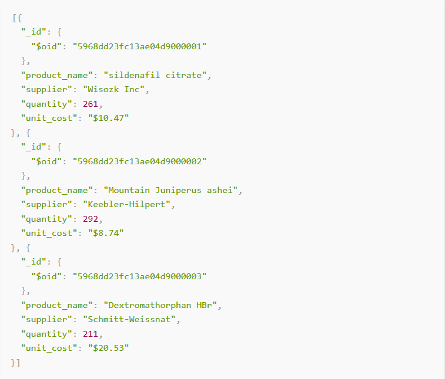

# Prerequisites

## Packages

```{r, message=FALSE, warning=FALSE}
# install.packages("tidyverse")
library(tidyverse)
```

```{r, message=FALSE, warning=FALSE}
library(readxl)
library(DBI)
library(RMySQL) # install.packages("RMySQL")
library(httr)
library(jsonlite)
library(haven)
```

## Data
Today we'll work with a number of datasets. They are located in 
_slides/week5/data_ and on moodle.

* _potatoes_: impact of storage and cooking on potatoes' flavor

* _urbanpop_: worldwide urban population metrics over time

* _sales_: data on the age, gender, income, and purchase level

* _sugar_: data on yearly import and export numbers of sugar

* _personality_: data on Big Five personality traits for 434 persons

# Importing data from flat files

## `read.table()`

* Main function for reading data into R
* Flexible and robust but requires more parameters
* Reads the data into RAM - big data can cause problems
* Important parameters _file_, _header_, _sep_, _row.names_, _nrows_
* Related: `read.csv()`, `read.csv2()`

```{r, eval = FALSE}
potatoes <- read.table(file = "data/potatoes.csv",
                     sep = ",", header = TRUE)
```

## `read.csv`
`read.csv()` sets _sep=","_ and _header=TRUE_

```{r}
potatoes <- read.csv("data/potatoes.csv")
head(potatoes)
```

## Some more important parameters

* _quote_: tell R whether there are any quoted values, quote="" means no quotes.
* _na.strings_: set the character that represents a missing value. 
* _nrows_: how many rows to read of the file.
* _skip_: number of lines to skip before starting to read

## Reasons to use `readr` instead
* ~10x faster than base `read.table()` functions (use the `fread()` from `data.table` if you want even more speed)

* Long running jobs have a progress bar
  
* leave strings as is by default, and automatically parse common date/time formats.

* all functions work exactly the same way regardless of the current locale.

## `readr` 

* `read_csv()`: comma delimited files
* `read_csv2()`: semicolon separated files
* `read_tsv()`: tab delimited files
* `read_delim()`: files with any delimiter

* `read_fwf()`: fixed width files (`fwf_widths()` or `fwf_positions()` 
* `read_table()`: files where columns are separated by white space

* `read_log()` reads Apache style log files

## `read_csv()`
`read_csv()` uses the first line of the data for the column names

```{r}
potatoes <- read_csv("data/potatoes.csv")
```

You can also supply an inline csv file. Use `"\n"` to add a new line.

```{r}
read_csv("a,b,c
1,2,3\n4,5,6")
```

## `read_csv()`
You can use `skip = n` to skip the first n lines; or use `comment = "#"` to drop all lines that start with (e.g.) `#`:

```{r, warning=FALSE}
potatoes <- read_csv("data/potatoes.csv", skip = 2)
```

## `read_csv()`

You can use `col_names = FALSE` to not treat the first row as headings, and instead label them sequentially from `X1` to `Xn:

```{r}
read_csv("1,2,3\n4,5,6", col_names = FALSE)
```

Alternatively you can supply your own column names with `col_names`:

```{r}
read_csv("1,2,3\n4,5,6", col_names = c("x", "y", "z"))
```

## `read_csv()`
Other arguments to `read_csv()`:

* `locale`: determine encoding and decimal mark.
* `na`, `quoted_na`: control which strings are treated as missing values
* `trim_ws`: trims whitespace before and after cells
* `n_max`: sets how many rows to read
* `guess_max`: sets how many rows to use when guessing the column type
* `progress`: determines whether a progress bar is shown.

## `read_delim`
`read_delim` is the main readr function and takes two mandatory arguments, _file_ and _delim_.

```{r, message=FALSE}
properties <- c("area", "temp", "size", "storage",
                "method", "texture", "flavor",
                "moistness")
potatoes <- read_delim("data/potatoes.txt", delim = "\t",
                       col_names = properties)
```

## `readr` parser
To figure out the type of each column `readr` reads the first 1000 rows and uses some heuristics to figure out the type of each column. You can try it out with `guess_parser()`, which returns `readr`'s best guess:

## `readr` parser

```{r}
guess_parser("2010-10-01")
guess_parser("15:01")
guess_parser(c("TRUE", "FALSE"))
guess_parser(c("1", "5", "9"))
```

## `readr()` col_types

You can use `col_types` to specify which types the columns in your imported data frame should have. You can manually set the types with a string, where each character denotes the class of the column: `c`haracter, `d`ouble, `i`nteger and `l`ogical. `_` skips the column as a whole.

```{r}
potatoes <- read_tsv("data/potatoes.txt", 
                     col_types = "cccccccc",
                     col_names = properties)
```

## Exercises

1. What is wrong with each of the following inline CSV files. 
    
```{r, eval = FALSE}
read_csv("a,b\n1,2,3\n4,5,6")
read_csv("a,b,c\n1,2\n1,2,3,4")
read_csv("a;b\n1;3")
```
    
## Exercises solutions

```{r, eval = FALSE}
# Only two columns are specified in the 
# header “a” and “b”
read_csv("a,b\n1,2,3\n4,5,6")
# There are only two values in row 1, 
# so column c is set to NA
read_csv("a,b,c\n1,2\n1,2,3,4")
# The values are separated by “;” 
# not “,”. Use read_csv2 instead
read_csv("a;b\n1;3")
```
    

# Import Excel files

## `readxl`
The `readxl` package makes it easy to get data out of Excel and into R.
`readxl` supports both .xls format and the modern xml-based .xlsx format.

You can use the `excel_sheets()` function to find out which sheets are available in the workbook. 

```{r}
excel_sheets(path = "data/urbanpop.xlsx")
```

## `readxl`
Use `read_excel()` to read in Excel files. You can pass a number (or string) to the `sheet` argument  to import a specific sheet.. 


```{r}
pop1 <- read_excel("data/urbanpop.xlsx", sheet = 1)
pop2 <- read_excel("data/urbanpop.xlsx", sheet = 2)
pop3 <- read_excel("data/urbanpop.xlsx", sheet = 3)

pop <- lapply(excel_sheets(path = "data/urbanpop.xlsx"),
              read_excel, path = "data/urbanpop.xlsx")

```

## `readxl`

You can use `skip` to control which cells are read and `col_names` to set the column names.

```{r}
pop <- read_excel(path = "data/urbanpop.xlsx", sheet=2,
                  skip=21, col_names=FALSE)
```


# Importing data from databases

## `DBI`
To import data from a database you first have to create a connection to it. You need different packages depending on the database you want to connect. `dbConnect()` creates a connection between your R session and a SQL database. The first argument has to be a `DBIdriver` object, that specifies how connections are made and how data is mapped between R and the database. If the SQL database is a remote database hosted on a server, you'll also have to specify the following arguments in dbConnect(): `dbname`, `host`, `port`, `user` and `password`.

## Establish a connection

```{r}
host <- "courses.csrrinzqubik.us-east-1.rds.amazonaws.com" 
con <- dbConnect(RMySQL::MySQL(),
                 dbname = "tweater",
                 host = host, 
                 port = 3306,
                 user = "student",
                 password = "datacamp")
```

## List the database tables
After you've successfully connected to a remote database. you can use `dbListTables()` to see what tables the database contains:

```{r}
tables <- dbListTables(con)
tables
```

## Import data from tables

You can use the `dbReadTable()` function to import data from the database tables. 

```{r}
users <- dbReadTable(con, "users")
users
```

## Import data from tables
Again, you can use lapply to import all tables:

```{r}
tableNames <- dbListTables(con)
tables <- lapply(tableNames, dbReadTable, conn = con)
```

## Exercise
The `tweats` table contains a column `user_id`, which refer to the users that have posted the tweat. The `comments` table contain both a `user_id` and a `tweat_id` column. Who posted the tweat on which somebody commented "awesome! thanks!" (comment 1012)? Be polite and disconnect from the database afterwards. You do this with the `dbDisconnect()` function.

## Exercise solution
The user with `user_id` 5: Oliver.

```{r}
dbDisconnect(con)
```

# Importing data from the web

## Import files directly from the web
You can use `read_csv` to directly import csv files from the web.

```{r, message=FALSE}
url <- paste0("https://raw.githubusercontent.com/",
"mhaber/HertieDataScience/master/",
"slides/week5/data/potatoes.csv")
potatoes <- read_csv(url)
```

## Download files
`read_excel()` does not yet support importing excel files directly from the web so you have to download the file first with `download.file()`:

```{r}
url <- paste0("https://github.com/",
"mhaber/HertieDataScience/blob/master/",
"slides/week5/data/urbanpop.xlsx?raw=true")
download.file(url, "data/urbanpop.xlsx", mode = "wb")
urbanpop <- read_excel("data/urbanpop.xlsx")
```

## `httr`
The `httr` package provides a convenient function `GET()` to download files. The result is a response object, that provides easy access to the content-type and the actual content. You can extract the content from the request using the `content()` function

```{r}
url <- "http://www.example.com/"
resp <- GET(url)
content <- content(resp, as = "raw")
head(content)
```

## JSON

\alert{JSON}

* Javascript Object Notation
* Lightweight data storage
* Common format for data from application programming interfaces (APIs)
* Similar structure to XML but different syntax
* Data stored as
  * Numbers (double)
  * Strings (double quoted)
  * Boolean (_true_ or _false_)
  * Array (ordered, comma separated enclosed in square brackets _[]_)
  * Object (unorderd, comma separated collection of key:value pairs in curley brackets _{}_)


[http://en.wikipedia.org/wiki/JSON](http://en.wikipedia.org/wiki/JSON)

## Example JSON file

```{r, out.width = "250px", echo = F, fig.align='center'}

```  

## Reading data from JSON (with `jsonlite`)

```{r}
url <- paste0("http://mysafeinfo.com/api/",
"data?list=englishmonarchs&format=json")
jsonData <- fromJSON(url)
str(jsonData)
```

## Writing data frames to JSON
You can use `toJSON()` to convert R data to a JSON object. JSONs can come in mini or pretty format with indentation, whitespace and new lines.

```{r, eval = FALSE}
# Mini
{"a":1,"b":2,"c":{"x":5,"y":6}}
# Pretty
{
  "a": 1,
  "b": 2,
  "c": {
    "x": 5,
    "y": 6
  }
}
```


```{r, eval = FALSE}
myJson <- toJSON(iris, pretty = TRUE)
minify(myJson)
```


## Convert back to JSON

```{r}
myJson <- toJSON(iris)
iris2 <- fromJSON(myJson)
head(iris2)
```

## Exercise
1. Create an object called `json1` that contains a vector with the numbers 1 up to 6, in ascending order.

2. Create an object `json2` that contains a named list with two elements: `a`, containing the numbers 1, 2 and 3 and `b`, containing the numbers 4, 5 and 6.

3. Call `fromJSON()` on both `json1` and `json2`

## Exercise solution

```{r}
json1 <- '[1, 2, 3, 4, 5, 6]'
json2 <- '{"a": [1, 2, 3], "b": [4, 5, 6]}'
fromJSON(json1)
fromJSON(json2)
```


# Importing data from other statistical software

## Importing data from other statistical software
We can use `haven()` to read data from other statistical software packages such as SAS, STATA and SPSS.

* _SAS_: `read_sas()`
* _STATA_: `read_dta()`
* _SPSS_: `read_sav()` or `read_por()`, depending on the file type.

All of these functions take the path to your local (or online) file.

## `read_sas()`

```{r}
sales <- read_sas("data/sales.sas7bdat")
str(sales)
```

## `read_dta()`
With Stata data files, it can also happen that some of the variables you import have the labelled class. This is done to keep all the labelling information that was originally present in the `.dta`.It's advised to change these variables to factors or other standard R classes.  

```{r}
sugar <- read_dta("data/sugar.dta")
sugar$Date <- as.Date(as_factor(sugar$Date))
```

## `read_sav()`

```{r}
personality <- read_sav("data/personality.sav")
```
# Importing data from other sources

## Images

* jpeg - [http://cran.r-project.org/web/packages/jpeg/index.html](http://cran.r-project.org/web/packages/jpeg/index.html)
* readbitmap - [http://cran.r-project.org/web/packages/readbitmap/index.html](http://cran.r-project.org/web/packages/readbitmap/index.html)
* png - [http://cran.r-project.org/web/packages/png/index.html](http://cran.r-project.org/web/packages/png/index.html)
* EBImage (Bioconductor) - [http://www.bioconductor.org/packages/2.13/bioc/html/EBImage.html](http://www.bioconductor.org/packages/2.13/bioc/html/EBImage.html)


## Geospatial data

* rgdal - [http://cran.r-project.org/web/packages/rgdal/index.html](http://cran.r-project.org/web/packages/rgdal/index.html)
* rgeos - [http://cran.r-project.org/web/packages/rgeos/index.html](http://cran.r-project.org/web/packages/rgeos/index.html)
* raster - [http://cran.r-project.org/web/packages/raster/index.html](http://cran.r-project.org/web/packages/raster/index.html)

## Music data

* tuneR - [http://cran.r-project.org/web/packages/tuneR/](http://cran.r-project.org/web/packages/tuneR/)
* seewave - [http://rug.mnhn.fr/seewave/](http://rug.mnhn.fr/seewave/)


# Homework Exercises

## Homework Exercises
There will be no homework assignments this week. 

##  {.standout}
That's it for today. Questions?    

