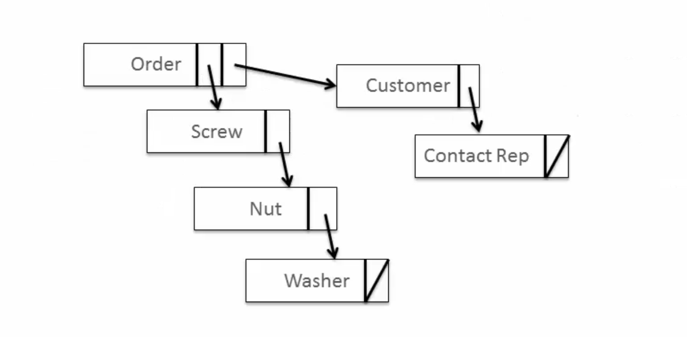
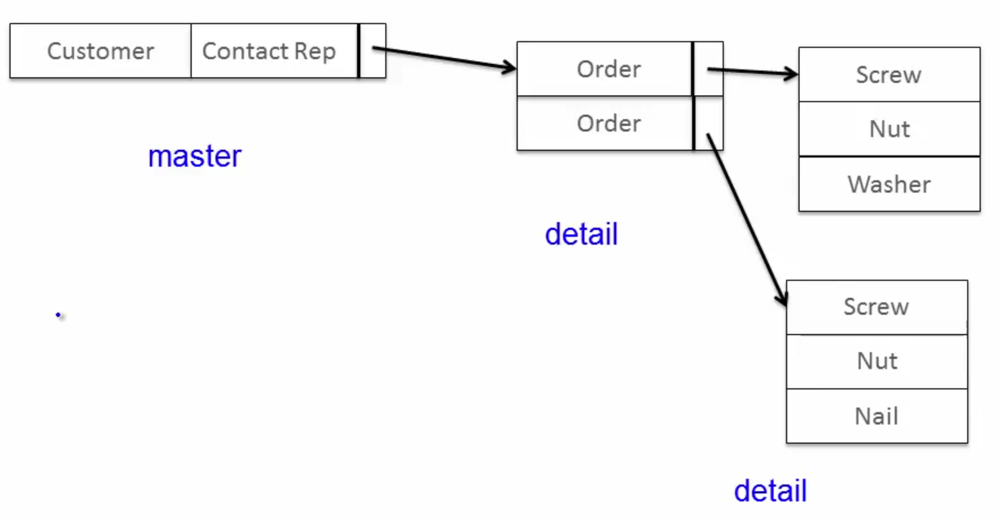
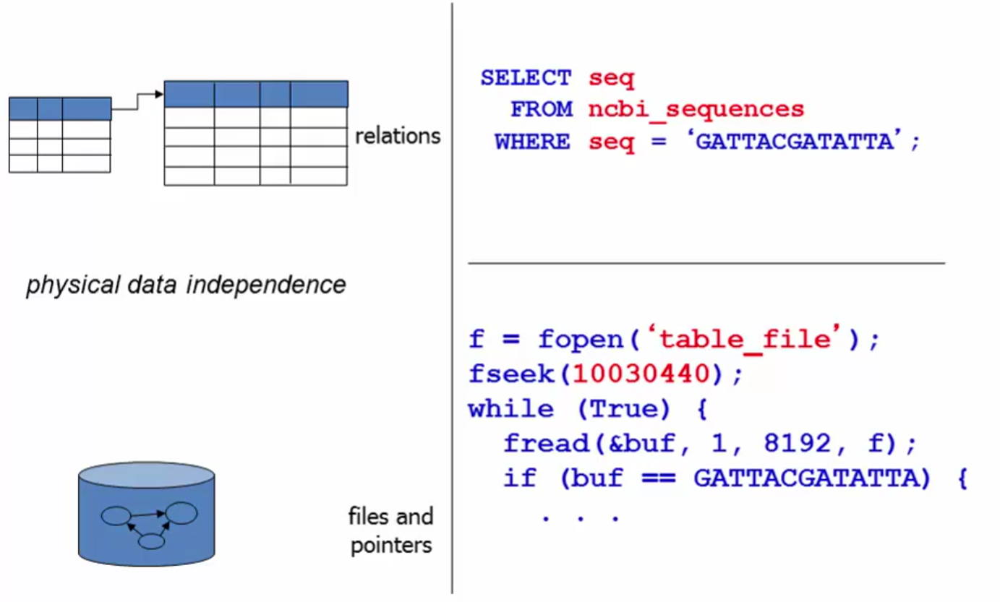
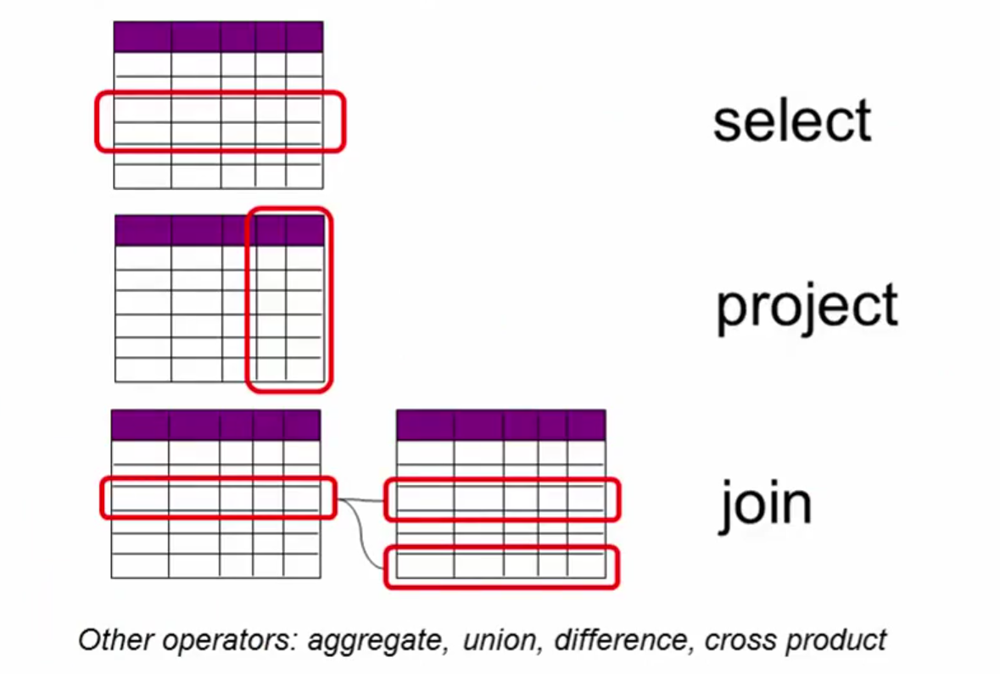
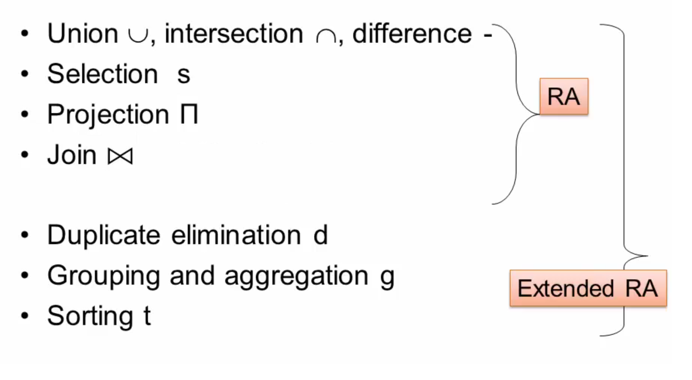
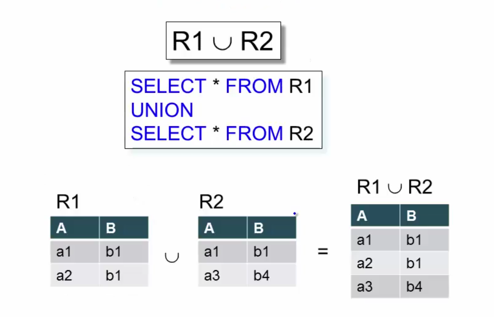
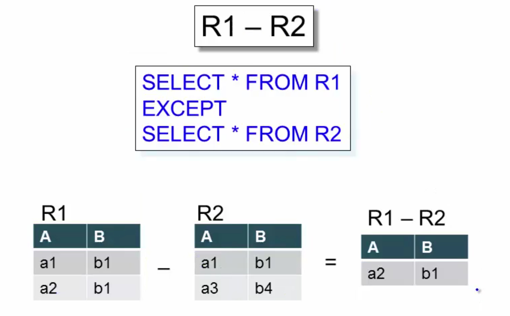
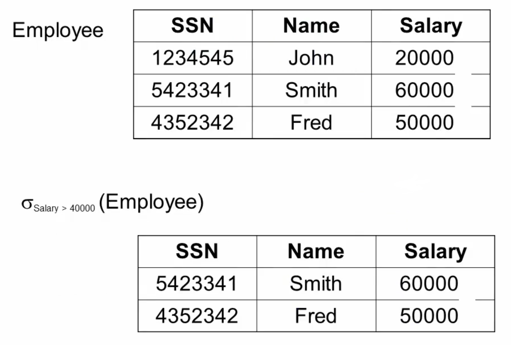
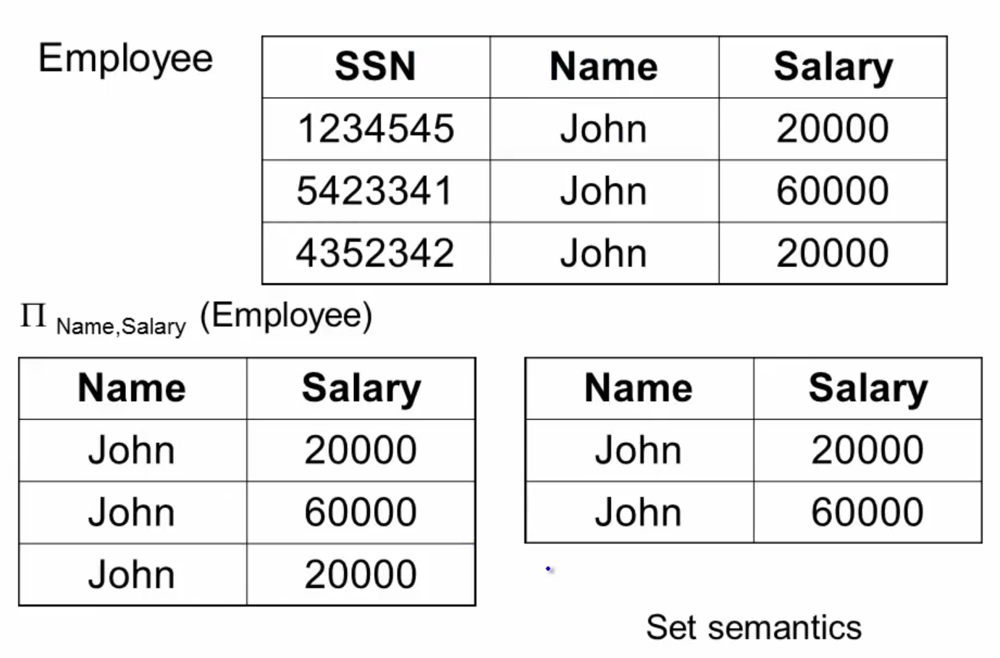
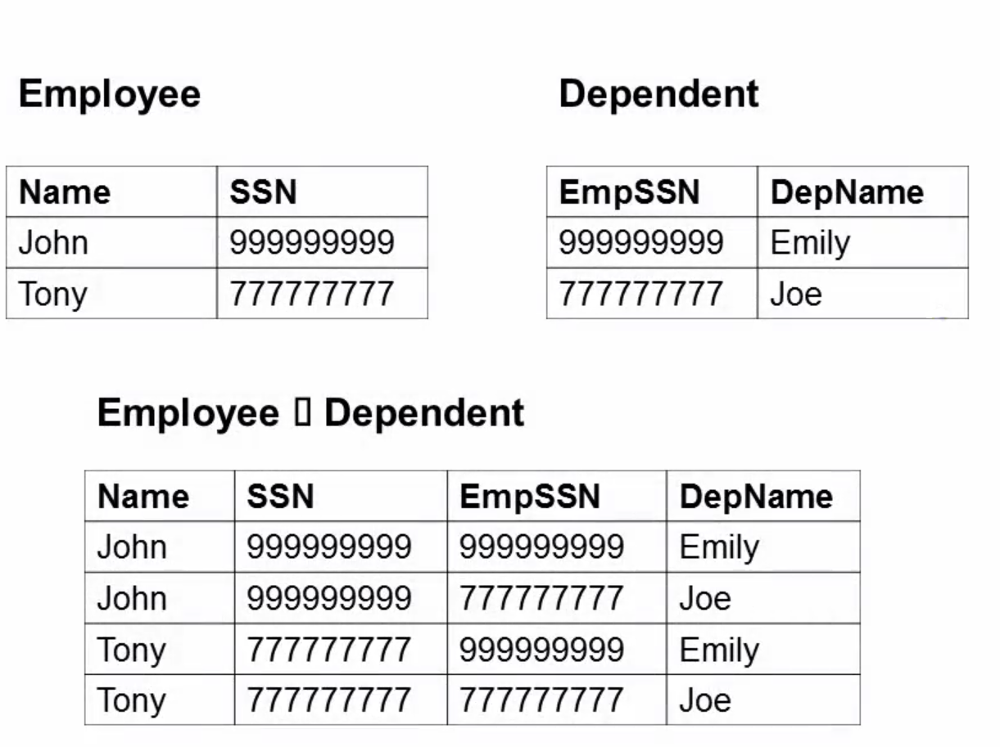

# Last weeks Homework

## Last weeks Homework

```{r, message=FALSE, warning=FALSE}
library(readxl)
library(tidyverse)
iiag <- read_excel("data/iiag.xls", sheet = 5, skip = 5) 
```
## Last weeks Homework

```{r, message=FALSE, warning=FALSE}
iiag %>% 
  gather(variable,value,-V1) %>% 
  spread(V1, value) %>%
  mutate(variable = readr::parse_number(variable)) %>% 
  arrange(variable) %>% 
  select(-variable) %>%
  fill(Indicator) %>% 
  select(Indicator, Year, everything()) %>% 
  gather(country, value, Algeria:Zimbabwe) %>% 
  arrange(country, Year, Indicator) %>% 
  filter(row_number() == 1518) %>% 
  select(value)
```

## Last weeks Homework

Which of the following is not a symptom of messy data?

* Multiple values are stored in one column

Which of the following is a principle of tidy data?

* Each observation forms a row, each variable forms a column, and each type of observational unit forms a table

* Each value belongs to a variable and an observation

* A dataset is a collection of values


# Final project

## Final project

Your goal is to apply your data science skills to process a large dataset and analyze it using your own ideas. You can select a dataset from a number of interesting datasets (e.g. the Armed Conflict Location & Event Data) or suggest your own. Specifically, you will have to

1. Prepare your data set for analysis (25%)

    + Load the data and perform the necessary data cleaning and manipulation steps
    
2. Perform exploratory data analysis and visualize interesting descriptive facts about your data (25%)

## Final project

3. Develop and specify ideas for analyzing your data and run the appropriate statistical model (25%) 

    + e.g. regression analysis, machine learning, etc.

4. Present and discuss your results (25%)

    + Appropriate graphical presentations of results (watch out for the quality of graphs)
    + BONUS: Create an interactive interface to your data (e.g. shiny, plotly, etc.)
    
## Final project

- You will need to set up your own public GitHub repository for your project
- ~8 page document written in R Markdown (week 10)
- Team-work is encouraged 
- Due 15 December

# Prerequisites

## Packages

```{r, message=FALSE, warning=FALSE}
library(tidyverse)
library(dbplyr) # install.packages("dbplyr")
library(DBI)
library(RSQLite) # install.packages("RSQLite")
library(nycflights13)
library(readr)
```

## Data

```{r, message = FALSE, warning = FALSE}
url <- paste0("https://raw.githubusercontent.com/mhaber/",
              "HertieDataScience/",
              "master/slides/week7/data/")
films <- read_csv(paste0(url, "films.csv"))
people <- read_csv(paste0(url, "people.csv"),
                   col_types = "iccc")
reviews <- read_csv(paste0(url, "reviews.csv"))
roles <- read_csv(paste0(url, "roles.csv"))
#flights
```

# Relational data

## Relational data

Data analysis rarely involves only a single table, but many tables of data, and you must combine them to answer the questions that you’re interested in. Collectively, multiple tables of data are called \alert{relational data} because it is the relations that are important.

The most common place to find relational data is in a relational database management system (or RDBMS).

## Databases

What is a database:

> A collection of information organized to afford efficient retrievel.

> "When people use the word database, fundamentally what they are saying is that the data should be self-describing and it should have a schema." (Jim Gray)

## Databases

Advantages of databases:

1. Sharing

    + Support concurrent access by multiple readers and writers
    
2. Data Model Enforcement

    + Make sure all applications see clean, organized data
    
3. Scale

    + Work with datasets too large to fit into memory
    
4. Flexibility

    + Use the data in new, unanticipated ways

## Pre-Relational Databases

Evaluate databases:

* How are the data physically organized on disk?

* What kinds of queries are efficiently supported, and which are not?

* How hard is it to update the data, or add new data

* What happes when I encounter new queries that I didn't anticipate. Do I reorganize the data?

## Historical example: network databases

```{r, echo = FALSE, out.width = NULL}

```

* All programs must be rewritten to accommodate reorganizations of the data

* difficultto look up all orders that involve a specific part


## Historical example: hierachical databases

```{r, echo = FALSE, out.width = NULL}

```

- hierachical order of data in terms of segments

    + works great if you want to find all orders for a particular customer
    + but what if you want to find all customers who ordered a Nail?


## Relational databases

Key idea of relational databases

> "Relational Database Management Systems were invented to let you use one set of data in multiple ways. Including ways that were unforeseen at the time the database is built, and then at the time the first applications are written."
              (Curt Monash)

## Relational database philisophy

> God made the integers; all else is the work of man.
(Leopold Kronecker, 19th century mathematician)

> Cood made relations; all else is the work of man.
(Raghu Ramakrishnan, DB text book author)

## Relational databases concept

Relational databases (Edgar Codd 1970)

* Everything is a table
* Every row in a table has the same (types of) columns 
* Relationships are implicit: no pointers

## Relational databases concept

```{r, echo = FALSE}
rdb1 <- data.frame(course = c("GRAD-E123", " GRAD-E123", " GRAD-E456", "GRAD-E456"), Student_ID = c(223, 224, 255, 244))
rdb2 <- data.frame(Student_ID = c(223, 224, 255), Student_Name = c("Jane", "Joe", "Susan"))
knitr::kable(rdb1)
knitr::kable(rdb2)
```


## Relational databases concept

* Pre relational: if your data changed, your application broke
* Early RDBMS were buggy and slow, but required only 5% of the application code

Notion of data independence:

> "Activities of users at terminals and most application programs should remain unaffected when the internal representation of data is changed and even when some aspects of the external representation are changed."
(Ted Cod)

## Physical data independence

Access data through a high-level language (SQL), not physical pointers.

```{r, echo = FALSE, out.width = NULL}

```

## Algebra of tables

Use operations from relational algebra and set theory.

```{r, echo = FALSE, out.width = NULL}

```

## Algebraic optimization

$N = ((z*2)+((z*3)+0))/1$

## Algebraic optimization

$N = ((z*2)+((z*3)+0))/1$

Algebraic laws:

1. $x+0 = x$
2. $x/1 = x$
3. $(n*x+n*y)= n*(x+y)$ 
4. $x*y=y*x$

Apply rules 1,3,4,2:
$N=(2+3)*z$

All relational databases do algebraic optimization when you write a query.

## Relational algebra operators

```{r, echo = FALSE, out.width = NULL}

```

## Sets vs. bags

Sets: {a,b,c}, {a,d,e,f}, {},...
Bags: {a,a,b,c}, {b,b,b,b,b},...

Relational algebra has two semantics:

* Set semantics = standard relational algebra
* Bag semantics = extented relational algebra 

Rule of thumb:

- Every commercial database will assume bag semantics

## Union

```{r, echo = FALSE, out.width = NULL}

```

## Difference

```{r, echo = FALSE, out.width = NULL}

```

## Intersection

- Derived operator using minus:

$R1 \cap R2 = R1-(R1-R2)$

- Derived using joins:

$R1 \cap R2 = R1 \bowtie R2$

## Selection

- Returns all tuples which satisfy a condition

$\sigma_c(R)$

- The condition $c$ can be $=,<,\leq, >, \geq,<>$

- And you can also use boolean expression (and, or ,not)

## Selection

```{r, echo = FALSE, out.width = NULL}

```

## Projection

- Eliminates columns

$\prod_{A1,...,An}(R)$

## Projection

```{r, echo = FALSE, out.width = NULL}

```

## Cross Product

- Each tuple in $R1$ with each tuple in $R2$: $R1 \times R2$

- Rare in practice, but can come up in analytics

    + e.g. find all pairs of similar tweets

## Cross Product

```{r, echo = FALSE, out.width = NULL}

```

## Join

A join is a way of connecting each row in `x` to zero, one, or more rows in `y`. The following diagram shows each potential match as an intersection of a pair of lines.

```{r, echo = FALSE, out.width = NULL}
knitr::include_graphics("img/join-setup2.png")
```

## Inner join

The simplest type of join is the __inner join__. An inner join matches pairs of observations whenever their keys are equal. Unmatched rows are not included in the result

```{r, echo = FALSE, out.width = NULL}
knitr::include_graphics("img/join-inner.png")
```

## Outer joins

An inner join keeps observations that appear in both tables. An __outer join__ keeps observations that appear in at least one of the tables. There are three types of outer joins:

* A __left join__ keeps all observations in `x`.
* A __right join__ keeps all observations in `y`.
* A __full join__ keeps all observations in `x` and `y`.

```{r, echo = FALSE, out.width = NULL}
knitr::include_graphics("img/join-outer.png")
```

The most commonly used join is the left join: you use this whenever you look up additional data from another table, because it preserves the original observations even when there isn't a match.

# SQL

## SQL

\alert{S}tructure \alert{Q}uery \alert{L}anguage is a language for interacting with databases. SQL is over 40 years old, and is used by pretty much every database in existence.

- A query is a request for data from a database table (or combination of tables)

- SQL can be used to query but also to create and modify databases. 

## `SELECT`

In SQL, you can select data from a table using a `SELECT` statement. For example, the following query selects the name column `FROM` the people table:

```{r,eval = FALSE}
SELECT name
FROM people
```

`SELECT` and `FROM` are keywords. They are not case-sensitive but it's good practice to make SQL keywords uppercase to distinguish them from other parts of your query, like column and table names.

## `SELECT`

To select multiple columns from a table, simply separate the column names with commas!

```{r,eval = FALSE}
SELECT name, birthdate
FROM people
```

To select all columns

```{r,eval = FALSE}
SELECT *
FROM people
```

You can also `LIMIT` the number of rows returned:

```{r,eval = FALSE}
SELECT *
FROM people
LIMIT 10
```

## `SELECT DISTINCT`

You can use the `DISTINCT` keyword to select all the unique values from a column.

```{r,eval = FALSE}
SELECT DISTINCT language
FROM films
```

## `COUNT`

The `COUNT` statement returns the number of rows in one or more columns.

```{r,eval = FALSE}
SELECT COUNT(*)
FROM people
```

It's common to combine `COUNT` with `DISTINCT` to count the number of distinct values in a column.

```{r,eval = FALSE}
SELECT COUNT(DISTINCT birthdate)
FROM people
```

## `WHERE`

The `WHERE` keyword allows you to filter based on both text and numeric values in a table. The `WHERE` clause always comes after the `FROM` statement.

```{r,eval = FALSE}
SELECT title
FROM films
WHERE title = 'Metropolis'
```

## `WHERE AND`

You can build up your `WHERE` queries by combining multiple conditions with the `AND` keyword.

```{r,eval = FALSE}
SELECT title
FROM films
WHERE release_year > 1994
AND release_year < 2000
```

## `WHERE AND OR`

The `OR` operator allows you to select rows based on multiple conditions where some but not all of the conditions need to be met?

```{r,eval = FALSE}
SELECT title
FROM films
WHERE release_year = 1994
OR release_year = 2000
```

## `BETWEEN`

The `BETWEEN` keyword provides a useful shorthand for filtering values within a specified range. `BETWEEN` is always inclusive can be used with multiple `AND` and `OR` operators

```{r,eval = FALSE}
SELECT title
FROM films
WHERE release_year
BETWEEN 1994 AND 2000
```

## `WHERE IN`

The `IN` operator allows you to specify multiple values in a `WHERE` clause, making it easier and quicker to specify multiple `OR` conditions.

```{r,eval = FALSE}
SELECT name
FROM kids
WHERE age IN (2, 4, 6, 8, 10)
```

## `NULL` and `IS NULL`

`NULL` represents a missing or unknown value. You can check for NULL values using the expression `IS NULL`. 

```{r,eval = FALSE}
SELECT COUNT(*)
FROM people
WHERE birthdate IS NULL
```

You can use the `IS NOT NULL` operator to filter out missing values.

## `LIKE` and `NOT LIKE`

The `LIKE` operator can be used in a `WHERE` clause to search for a pattern in a column. You use a wildcard as a placeholder for some other values. There are two wildcards you can use with `LIKE`:

- The `%` wildcard will match zero, one, or many characters in text:

- The `_` wildcard will match a single character. 

For example,

```{r,eval = FALSE}
SELECT name
FROM companies
WHERE name LIKE 'Data%'
```

finds 'Data', 'Datab', 'Database'.

## Aggregate functions

SQL provides a few functions to perform some calculation on the data in a database. Those aggregate functions can also be combined with the `WHERE` clause

For example,

```{r,eval = FALSE}
SELECT AVG(budget)
FROM films
```

gives you the average value from the budget column of the films table. Similarly, the `MAX` function returns the highest budget:

```{r,eval = FALSE}
SELECT MAX(budget)
FROM films
```

## Aggregate functions

The `SUM` function returns the result of adding up the numeric values in a column:

```{r,eval = FALSE}
SELECT SUM(budget)
FROM films
```

## Arithmetics

You can perform basic arithmetic with symbols like `+`, `-`, `*`, and `/`.

For example, this gives a result of 12:

```{r,eval = FALSE}
SELECT (4 * 3)
```

However, the following gives a result of 1, 

```{r,eval = FALSE}
SELECT (4 / 3)
```

SQL assumes that if you divide an integer by an integer, you want to get an integer back. If you want more precision when dividing, you can add decimal places to your numbers.


## `AS`

You use the `AS` keyword to assign a temporary name to something (i.e. alias).

```{r,eval = FALSE}
SELECT MAX(budget) AS max_budget,
       MAX(duration) AS max_duration
FROM films
```

## `ORDER BY`

The `ORDER BY` keyword is used to sort results according to the values of one or more columns. By default `ORDER BY` will sort in ascending order. If you want to sort the results in descending order, you can use the `DESC` keyword.

```{r,eval = FALSE}
SELECT title
FROM films
ORDER BY release_year DESC
```

## `ORDER BY` multiple columns

`ORDER BY` can also be used to sort on multiple columns. It will sort by the first column specified, then sort by the next, then the next, and so on.

```{r,eval = FALSE}
SELECT birthdate, name
FROM people
ORDER BY birthdate, name
```

## `GROUP BY`

`GROUP BY` allows you to group a result by one or more columns. `GROUP BY` always goes after the `FROM` clause.

```{r,eval = FALSE}
SELECT sex, count(*)
FROM employees
GROUP BY sex
```

Commonly, `GROUP BY` is used with aggregate functions like `COUNT()` or `MAX()`. 

## `HAVING`

In SQL, aggregate functions can't be used in `WHERE` clauses. If you want to filter based on the result of an aggregate function, you need to use the `HAVING` clause.

```{r,eval = FALSE}
SELECT release_year
FROM films
GROUP BY release_year
HAVING COUNT(title) > 10
```

##  Joins

dplyr                        
-----------------------------|
`inner_join(x, y, by = "z")` |
`left_join(x, y, by = "z")`  |
`right_join(x, y, by = "z")` | 
`full_join(x, y, by = "z")`  | 

SQL
----------------------------------------------|
 `SELECT * FROM x INNER JOIN y USING (z)`     |
`SELECT * FROM x LEFT OUTER JOIN y USING (z)` |
`SELECT * FROM x RIGHT OUTER JOIN y USING (z)`|
`SELECT * FROM x FULL OUTER JOIN y USING (z)` |

## `UNION`, `INTERSECT`, `EXCEPT`

The `UNION` operator is used to combine the results of two or more `SELECT` statements without returning any duplicate rows.

```{r, eval = FALSE}
SELECT column1 
FROM table1
UNION
SELECT column1
FROM table1
```

The `INTERSECT` operator is used to combine two `SELECT` statements but returns rows only from the first `SELECT` statement that are identical to a row in the second `SELECT` statement.

The `EXCEPT` operator is used to combine two `SELECT` statements and returns rows from the first `SELECT` statement that are not returned by the second `SELECT` statement.
 
## User-defined function support
Most SQL database also allow user-defined functions,routines that perform an action, such as a complex calculation, and return the result of that action as a value.

- PostgreSQL

    + SQL, PL/pSQL, Python, C/C++, R
    
- Microsoft SQL Server

    + SQL, T-SQL, C#

- Oracle

    - SQL, PL-SQL, Java, C/C++, Python, others
    
- SQLite

    - None


# SQL in R

## SQL vs R

SQL is not designed to do data analysis. For example, calculate the median arrival delay per carrier.

Using `dplyr`:
```{r, eval = FALSE}
flights %>%
  dplyr::group_by(carrier) %>%
  dplyr::summarize(delay = median(arr_delay, na. rm =TRUE))
```

## SQL vs R

PostgreSQL:

```{r, eval = FALSE}
WITH ordered_flights AS (
 SELECT arr_delay,
        row_number() OVER (order by id) AS row_id,
        (SELECT COUNT(1) from flights) AS ct
 FROM flights
)

SELECT AVG(arr_delay) AS median
FROM ordered_flights
WHERE row_id BETWEEN ct/2.0 AND ct/2.0 + 1
```

## SQL and R

Good idea to store data in SQL and use R to analyze it.
`dbplyr`, for example, also works with remote on-disk data stored in databases.

The goal of `dbplyr` is to automatically generate SQL for you so that you’re not forced to use it. Most of the time you don’t need to know anything about SQL, and you can continue to use the `dplyr` verbs that you’re already familiar with

## Connecting to a database

You need to install a specific backend for the database that you want to connect to:

* `RMySQL` connects to MySQL and MariaDB

* `RPostgreSQL` connects to Postgres and Redshift

* `RSQLite` embeds a SQLite database (comes with `dbplyr`)

* `odbc` connects to many commercial databases via the open database connectivity protocol

* `bigrquery` connects to Google’s BigQuery

## Connecting to a database file

```{r}
con<-DBI::dbConnect(RSQLite::SQLite(),path = ":memory:")
```


## Connecting to an online database

```{r, eval = FALSE}
con <- DBI::dbConnect(RMySQL::MySQL(), 
  host = "database.rstudio.com",
  user = "hadley",
  password = rstudioapi::askForPassword(
    "Database password")
)
```

## Creating a database

```{r, warning=FALSE, message = FALSE}
con<-DBI::dbConnect(RSQLite::SQLite(),path = ":memory:")
dbWriteTable(con, "flights", nycflights13::flights)
dbListTables(con)
flights_db <- tbl(con, "flights")
```


## Generating queries

You can pass SQL queries with `dbGetQuery()` or `dbExecute()`.

```{r}
results <- DBI::dbGetQuery(con,
                           "SELECT arr_time AS arrivalTime
                           FROM flights
                           WHERE carrier = 'UA'")
```


## Generating queries

Most of the time you don’t need to know anything about SQL, and you can continue to use the `dplyr` verbs that you’re already familiar with:

```{r}
tailnum_delay_db <- flights_db %>% 
  dplyr::group_by(tailnum) %>%
  dplyr::summarize(
    delay = mean(arr_delay),
    n = n()
  ) %>% 
  dplyr::arrange(desc(delay)) %>%
  dplyr::filter(n > 100)
```

Your R code is translated into SQL and executed in the database, not in R. `dplyr` tries to be as lazy as possible:

* It never pulls data into R unless you explicitly ask for it.
* It collects together everything you want to do and then sends it to the database in one step.

## Generating queries

You can see the SQL `dplyr` generating with `show_query()`:

```{r}
tailnum_delay_db %>% show_query()
```

## Pull data from a database

Once you’ve figured it out what data you need from the database, use `collect()` to pull all the data down into a local tibble.

```{r}
tailnum_delay <- tailnum_delay_db %>% collect()
```

`collect()` requires that database does some work, so it may take a long time to complete.

# Group Exercise

## Group exercise
In today's exercise you'll be working with a database containing information on almost 5000 films.
Get together in groups of two or three and 

1. set up our own (SQLite) database
2. write the four objects `films`, `people`, `review`, `role` as tables into your database and use `dbListTables()` to make sure you did it correctly

## Group exercise
3. complete the following tasks using either SQL or `dplyr`'s language:

    + Get the title, release year and country for every film
    + Get all the different type of film roles
    + Count the number of unique languages
    + Get the number of films released before 2000
    + Get the name and birth date of the person born on November 11th, 1974. Remember to use ISO date format ('1974-11-11')
    + Get all information for Spanish language films released after 2000, but before 2010
    + Get the names of people who are still alive
    + Get the amount grossed by the best performing film between 2000 and 2012


## Group exercise
3. complete the following tasks using either SQL or `dplyr`'s language:

    + Get the average duration in hours for all films, aliased as `avg_duration_hours`
    + Get the IMDB score and count of film reviews grouped by IMDB score
    + Get the country, average budget, and average gross take of countries that have made more than 10 films.
    Order the result by country name, and limit the number of results displayed to 5. You should alias the
    averages as avg_budget and avg_gross respectively
    + Disconnect from your database
    

# Homework Exercises

## Homework Exercises
For this week's homework exersises go to Moodle and answer the Quiz posted in the Relational Data section.

Deadline: Sunday, October 30 before midnight.


##  {.standout}
That's it for today. Questions?    

