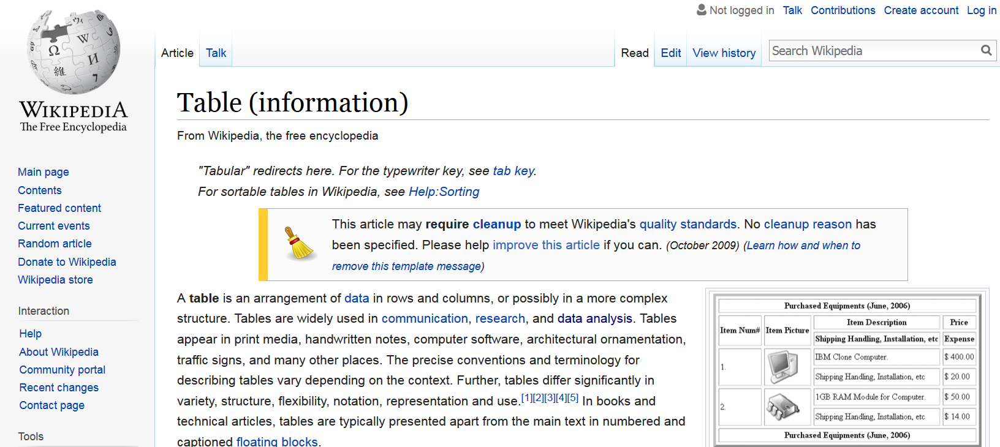
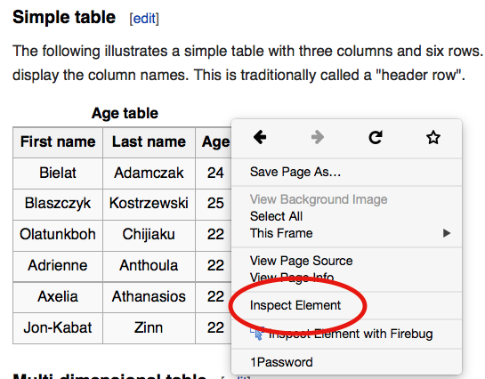
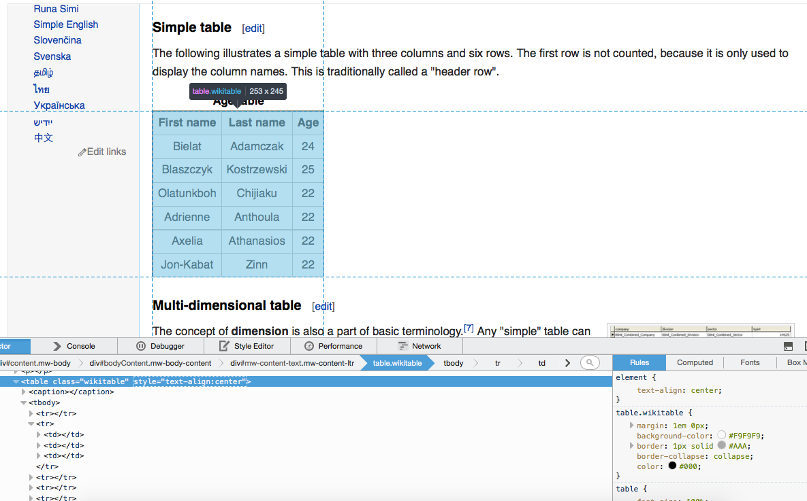

## Online text data sources

- **web pages** (e.g. http://example.com)
- **web formats** (XML, HTML, JSON, ...)
- **web frameworks** (HTTP, URL, APIs, ...)
- **social media** (Twitter, Facebook, LinkedIn, Snapchat, Tumbler, ...)
- **data in the web** (speeches, laws, policy reports, news, ... )
- **web data** (page views, page ranks, IP-addresses, ...)

## The Problems

**phase**     | **problems** | **examples**
--------------|--------------|----------------------------------------
**download**  | protocols    | HTTP, HTTPS, POST, GET, ... 
&nbsp;        | procedures   | cookies, authentication, forms, ...
--------------|--------------|-----------------------------------------
**extraction**| parsing      | translating HTML (XML, JSON, ...) into R
&nbsp;        | extraction   | getting the relevant parts
&nbsp;        | cleansing    | cleaning up, restructure, combine


## Before scraping, do some googling!

- If the resource is well-known, someone else has probably built a tool which solves the problem for you.
- [ropensci](https://ropensci.org/) has a [ton of R packages](https://ropensci.org/packages/) providing easy-to-use interfaces to open data.
- The [Web Technologies and Services CRAN Task View](http://cran.r-project.org/web/views/WebTechnologies.html) is a great overview of various tools for working with data that lives on the web in R.

## Example

```{r, out.width = "300px", echo = F}

```  


## Inspecting elements

```{r, out.width = "220px", echo = F}

```  

## Hover to find desired elements

```{r, out.width = "260px", echo = F}

```  


## Rvest

[rvest](https://github.com/hadley/rvest) is a nice R package for web-scraping by (you guessed it) Hadley Wickham.

- see also: https://github.com/hadley/rvest
- convenient package to scrape information from web pages
- builds on other packages, such as xml2 and httr
- provides very intuitive functions to import and process webpages


## Basic workflow of scraping with rvest


```{r}
library(rvest)
library(magrittr)

# 1. specify URL
"http://en.wikipedia.org/wiki/Table_(information)" %>% 

# 2. download static HTML behind the URL and parse it into an XML file
read_html() %>% 

# 3. extract specific nodes with CSS (or XPath)
html_node(".wikitable") %>%

# 4. extract content from nodes
html_table()
```

## Task 1

Navigate to *[this page](http://www.wunderground.com/history/airport/KVAY/2015/2/17/DailyHistory.html?req_city=Cherry+Hill&req_state=NJ&req_statename=New+Jersey&reqdb.zip=08002&reqdb.magic=1&reqdb.wmo=99999&MR=1)* and try the following:

**Easy**: Grab the table at the bottom of the page (hint: instead of grabbing a node by class with `html_node(".class")`, you can grab by id with `html_node("#id")`)

**Medium**: Grab the actual mean, max, and min temperature.

**Hard**: Grab the weather history graph and write the figure to disk (`download.file()` may be helpful here).


## Task 1 (solution)

```{r}
library(rvest)
src <- read_html(paste0("http://www.wunderground.com/history/",
"airport/KVAY/2015/2/17/DailyHistory.html?",
"req_city=Cherry+Hill&req_state=NJ&",
"req_statename=New+Jersey&reqdb.zip=08002",
"&reqdb.magic=1&reqdb.wmo=99999&MR=1"))

# easy solution
tab1 <- src %>% html_node("#obsTable") %>% html_table()
# medium solution
tab2 <- src %>% html_node("#historyTable") %>% html_table() %>%
  .[2:4, "Actual"]
# hard solution
link <- src %>% html_node("#history-graph-image img") %>% html_attr("src")
download.file(paste0("http://www.wunderground.com", link), 
              "fig.png", mode = "wb")
```

What about non-table data?

## Selectorgadget + rvest to the rescue!

- [Selectorgadget](http://selectorgadget.com/) is a [Chrome browser extension](https://chrome.google.com/webstore/detail/selectorgadget/mhjhnkcfbdhnjickkkdbjoemdmbfginb?hl=en) for quickly extracting desired parts of an HTML page.

- With some user feedback, the gadget find out the [CSS selector](http://www.w3.org/TR/2011/REC-css3-selectors-20110929/) that returns the highlighted page elements.

- Let's try it out on [this page](http://www.sec.gov/litigation/suspensions.shtml)


## Extracting links to download reports

```{r}
domain <- "http://www.sec.gov"
susp <- paste0(domain, "/litigation/suspensions.shtml")
hrefs <- read_html(susp) %>% html_nodes("tr+ tr a:nth-child(1)") %>% 
  html_attr(name = "href")
```

```{r, eval = FALSE}
# download all the pdfs!
hrefs <- hrefs[!is.na(hrefs)]
pdfs <- paste0(domain, hrefs)
mapply(download.file, pdfs, basename(pdfs))
```


## Technologies and Packages

- Regular Expressions / String Handling

    + **stringr**, stringi

- HTML / XML / XPAth / CSS Selectors

    + **rvest**, xml2, XML

- JSON

    + **jsonlite**, RJSONIO, rjson

- HTTP / HTTPS

    + **httr**, curl, Rcurl

- Javascript / Browser Automation

    + **RSelenium**

- URL

    + **urltools**

## Readings

- Basics on HTML, XML, JSON, HTTP, RegEx, XPath

    + Munzert et al. (2014): Automated Data Collection with R. Wiley. http://www.r-datacollection.com/

- curl / libcurl

    + http://curl.haxx.se/libcurl/c/curl_easy_setopt.html

- CSS Selectors

    + W3Schools: http://www.w3schools.com/cssref/css_selectors.asp

- Packages: httr, rvest, jsonlite, xml2, curl

    + Readmes, demos and vignettes accompanying the packages

- Packages: RCurl and XML

    + Munzert et al. (2014): Automated Data Collection with R. Wiley. Nolan and Temple-Lang (2013): XML and Web Technologies for Data Science with R. Springer


## Twitter

**Twitter has two types of APIs**

- REST APIs --> reading/writing/following/etc.

- Streaming APIs --> low latency access to 1% of global stream - public, user and site streams

- authentication via OAuth

- documentation at https://dev.twitter.com/overview/documentation

## Accessing the twitter APIs

To access the REST and streaming APIs, you will need to create a twitter application, and generate authentication credentials associated with this application. To do this you will first need to have a twitter account. You will also need to install at least the following R packages: `twitteR`, 


```{r, eval = FALSE}
install.packages(c('twitteR', 'streamR', 'RCurl', 'ROAuth', 'httr'))
```

## Create a twitter application

To register a twitter application and get your consumer keys:

1. Go to <https://apps.twitter.com> in a web browser.
2. Click on 'create new app'.
3. Give your app a unique name, a description, any relevant web address, and agree to the terms and conditions. Set the callback URL to http://127.0.0.1:1410.
4. Go to the keys and access section of the app page, and copy your consumer key and consumer secret to the code below.
5. (optional): For actions requiring write permissions, generate an access token and access secret.

## Use twitter in R

```{r, eval = FALSE}
library(twitteR)
library(streamR)
library(ROAuth)

consumerKey <- 'your key here'
consumerSecret <- 'your secret here'

# Try this first, to use twitteR
setup_twitter_oauth(consumerKey, consumerSecret)
results <- searchTwitter('#Trump')
df <- as.data.frame(t(sapply(results, as.data.frame)))
```

Then try these instructions, to use streamR:
<https://github.com/pablobarbera/streamR#installation-and-authentication>


## Media data from LexisNexis

Nexis includes a large selection of international newspapers updated daily. Among them The Daily Telegraph, International New York Times, The Observer, Le Figaro, Le Monde, Corriere della Sera, taz, die tageszeitung, Die ZEIT.

You can access Nexis through the Hertie Library: https://www.hertie-school.org/en/library/resources/#c6741 (scroll down till you find the Nexis link).

## Parse data from Nexis into R

```{r}
library(tm)
library(tm.plugin.lexisnexis)
library(quanteda)
 
ln <- LexisNexisSource("lexisnexis.HTML")
tmCorpus <- VCorpus(ln)
myCorpus <- corpus(tmCorpus)
mydfm <- dfm(myCorpus)
```

# Homework Exercises

## Homework Exercises
For this week's homework exersises go to Moodle and answer the Quiz posted in the Relational Data section.

Deadline: Sunday, October 29 before midnight.


##  {.standout}
That's it for today. Questions?    

